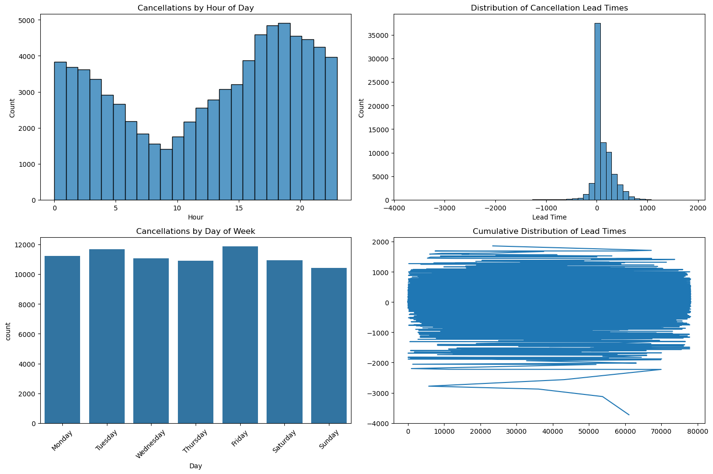

# Setup and Configuration


```python
# Import necessary libraries
import os
import sys
import pandas as pd
import numpy as np
import matplotlib.pyplot as plt
import seaborn as sns
import plotly.express as px
from datetime import datetime, timedelta

# Set display options
pd.set_option('display.max_columns', None)
pd.set_option('display.float_format', lambda x: '%.3f' % x)

# Environment checks
print(f"Python executable: {sys.executable}")  
print("Current working directory:", os.getcwd())
print("\nFiles in data directory:", os.listdir('data'))
```

    Python executable: C:\Users\josep\miniconda3\envs\CBH_CS2\python.exe
    Current working directory: C:\Users\josep\Documents\programming_projects\GitHub\CBH_CS2
    
    Files in data directory: ['booking_logs_large.csv', 'Booking_logs_sample_1000 - Sheet1.csv', 'Booking_logs_sample_100_rows.csv', 'Booking_logs_sample_header.csv', 'cancel_logs_large.csv', 'Cancel_logs_sample_1000 - Sheet1.csv', 'Cancel_logs_sample_100_rows.csv', 'Cancel_logs_sample_header.csv', 'cleveland_shifts_large.csv', 'Cleveland_shifts_Sample_1000 - Sheet1.csv', 'Cleveland_shifts_Sample_100_rows.csv', 'Cleveland_shifts_Sample_header.csv']
    

# Helper Functions and Classes


```python
# Helper Functions for Data Loading and Cleaning
# update: now takes varied date ranges into account in loading
def load_and_clean_shifts(df):
    """
    Load and clean shifts dataset
    
    Parameters:
        df (pd.DataFrame): Raw shifts dataframe
        
    Returns:
        pd.DataFrame: Cleaned shifts dataframe with proper datatypes
        
    Notes:
        - Makes a copy to avoid modifying original data
        - Converts datetime columns
        - Handles potential errors in datetime conversion
    """
    df = df.copy()
    
    # Convert datetime columns with error handling
    datetime_cols = ['Start', 'End', 'Created At']
    for col in datetime_cols:
        if col in df.columns:
            try:
                df[col] = pd.to_datetime(df[col], format='mixed')
            except Exception as e:
                print(f"Error converting {col} to datetime: {str(e)}")
                # Log problematic rows for investigation
                problematic_rows = df[pd.to_datetime(df[col], format='mixed', errors='coerce').isna()]
                if not problematic_rows.empty:
                    print(f"Problematic rows in {col}:")
                    print(problematic_rows[col].head())
    
    return df

def load_and_clean_bookings(df):
    """
    Load and clean booking logs dataset
    
    Parameters:
        df (pd.DataFrame): Raw bookings dataframe
        
    Returns:
        pd.DataFrame: Cleaned bookings dataframe with proper datatypes
    """
    df = df.copy()
    # Convert datetime columns
    try:
        df['Created At'] = pd.to_datetime(df['Created At'])
    except Exception as e:
        print(f"Error converting Created At: {str(e)}")
    return df

def load_and_clean_cancellations(df):
    """
    Load and clean cancellation logs dataset
    
    Parameters:
        df (pd.DataFrame): Raw cancellations dataframe
        
    Returns:
        pd.DataFrame: Cleaned cancellations dataframe with proper datatypes
    """
    df = df.copy()
    # Convert datetime columns with flexible parsing
    try:
        df['Created At'] = pd.to_datetime(df['Created At'], format='mixed')
        df['Shift Start Logs'] = pd.to_datetime(df['Shift Start Logs'], format='mixed')
    except Exception as e:
        print(f"Error in datetime conversion: {str(e)}")
        # Try to identify problematic rows
        prob_rows = df[pd.to_datetime(df['Shift Start Logs'], format='mixed', errors='coerce').isna()]
        if not prob_rows.empty:
            print("\nSample of problematic date formats:")
            print(prob_rows['Shift Start Logs'].head())
    
    return df

def categorize_lead_time(hours):
    """
    Categorize lead times based on business rules.
    
    Parameters:
        hours (float): Lead time in hours
        
    Returns:
        str: Category of lead time
    """
    if hours < 0:
        return 'No-Show'  # Cancelled after shift start
    elif hours < 4:
        return 'Late (<4hrs)'
    elif hours < 24:
        return 'Same Day'
    elif hours < 72:
        return 'Advance (<3 days)'
    return 'Early (3+ days)'

def clean_lead_times(cancellations_df):
    """
    Clean and categorize lead times in cancellation data
    
    Parameters:
        cancellations_df (pd.DataFrame): Raw cancellations dataframe
    
    Returns:
        pd.DataFrame: Cleaned cancellations data with categorized lead times
        pd.Series: Statistics about removed records for quality control
    """
    df = cancellations_df.copy()
    
    # Track data quality issues
    quality_stats = {
        'original_rows': len(df),
        'null_lead_times': df['Lead Time'].isnull().sum(),
        'infinite_values': (~np.isfinite(df['Lead Time'])).sum()
    }
    
    # Only remove truly invalid data
    mask = df['Lead Time'].notnull() & np.isfinite(df['Lead Time'])
    df = df[mask]
    
    # Add cleaned lead time without filtering extremes
    df['clean_lead_time'] = df['Lead Time']
    
    # Categorize all lead times
    df['cancellation_category'] = df['clean_lead_time'].apply(categorize_lead_time)
    
    # Add flags for extreme values for analysis
    df['is_extreme_negative'] = df['Lead Time'] < -72  # Flag cancellations >3 days after
    df['is_extreme_positive'] = df['Lead Time'] > 1000 # Flag cancellations >41 days before
    
    quality_stats['final_rows'] = len(df)
    quality_stats['removed_rows'] = quality_stats['original_rows'] - quality_stats['final_rows']
    
    return df, pd.Series(quality_stats)

# Data Summary Storage Class
class DataSummary:
    """Class to store and manage analysis results"""
    def __init__(self):
        self.summaries = {}
    
    def add_summary(self, dataset_name, summary_type, data):
        """Add summary statistics to storage"""
        if dataset_name not in self.summaries:
            self.summaries[dataset_name] = {}
        self.summaries[dataset_name][summary_type] = data
    
    def get_summary(self, dataset_name, summary_type=None):
        """Retrieve stored summary statistics"""
        if summary_type:
            return self.summaries.get(dataset_name, {}).get(summary_type)
        return self.summaries.get(dataset_name)
    
    def print_summary(self, dataset_name):
        """Print stored summaries for a dataset"""
        if dataset_name in self.summaries:
            print(f"\nSummary for {dataset_name}:")
            for summary_type, data in self.summaries[dataset_name].items():
                print(f"\n{summary_type}:")
                print(data)

# Initialize summary storage
summary = DataSummary()
```


```python
# Summary explorer helper functions 
def explore_summary(summary, indent=0, max_display_length=100):
    """
    Recursively explore and display the contents of the DataSummary object.
    
    Parameters:
        summary: The DataSummary object or a nested dictionary/value to explore
        indent: Current indentation level (default: 0)
        max_display_length: Maximum length for displayed values (default: 100)
    """
    def format_value(value):
        """Format a value for display, truncating if too long"""
        str_value = str(value)
        if len(str_value) > max_display_length:
            return str_value[:max_display_length] + '...'
        return str_value
    
    def print_indented(text, indent):
        """Print text with proper indentation"""
        print('    ' * indent + text)

    if isinstance(summary, DataSummary):
        # If we're starting with a DataSummary object, explore its summaries
        print("\n=== Complete Summary Contents ===\n")
        explore_summary(summary.summaries, indent)
    
    elif isinstance(summary, dict):
        # Recursively explore dictionary contents
        for key, value in summary.items():
            if isinstance(value, dict):
                print_indented(f"{key}:", indent)
                explore_summary(value, indent + 1)
            elif isinstance(value, pd.Series) or isinstance(value, pd.DataFrame):
                print_indented(f"{key}: [pandas {type(value).__name__}]", indent)
                str_repr = str(value)
                for line in str_repr.split('\n')[:5]:  # Show first 5 lines
                    print_indented(line, indent + 1)
                if len(str_repr.split('\n')) > 5:
                    print_indented('...', indent + 1)
            else:
                print_indented(f"{key}: {format_value(value)}", indent)
    
    else:
        # Base case: print the value
        print_indented(format_value(summary), indent)

def get_summary_structure(summary):
    """
    Print just the structure of the summary without all the data values.
    
    Parameters:
        summary: The DataSummary object
    """
    print("\n=== Summary Structure ===\n")
    for dataset_name in summary.summaries:
        print(f"\nDataset: {dataset_name}")
        for summary_type in summary.summaries[dataset_name]:
            print(f"  └── {summary_type}")

# Example usage:
print("First, let's see the overall structure of your summary:")
get_summary_structure(summary)

print("\nWould you like to see the complete contents of any specific dataset?")
print("You can view them using:")
print("explore_summary(summary.get_summary('dataset_name'))")

# To view everything:
print("\nOr view all contents with:")
print("explore_summary(summary)")
```

    First, let's see the overall structure of your summary:
    
    === Summary Structure ===
    
    
    Dataset: data_quality
      └── audit_results
      └── coverage_analysis
      └── missing_data_impact
    
    Dataset: bookings
      └── time_to_fill
      └── role_patterns
      └── rebooking_stats
      └── shape
      └── dtypes
      └── missing_values
      └── date_range
      └── unique_ids
    
    Dataset: economic
      └── overall_impact
      └── role_impact
      └── type_impact
    
    Dataset: complete_analysis
      └── shifts
      └── behavior
      └── missing_agents
    
    Dataset: cancellations
      └── quality_stats
      └── extreme_values
      └── action_types
      └── role_patterns
      └── shift_patterns
      └── role_impact
      └── shape
      └── dtypes
      └── missing_values
      └── date_range
      └── unique_ids
    
    Dataset: data_filtering
      └── overlap_period
    
    Dataset: shifts
      └── shape
      └── dtypes
      └── missing_values
      └── numeric_stats
      └── shift_types
      └── agent_types
      └── hour_distribution
      └── day_distribution
      └── facility_stats
      └── date_range
      └── unique_ids
    
    Dataset: cross_validation
      └── id_overlaps
    
    Would you like to see the complete contents of any specific dataset?
    You can view them using:
    explore_summary(summary.get_summary('dataset_name'))
    
    Or view all contents with:
    explore_summary(summary)
    

# Initial Data Loading and Validation


```python
# === Load and Prepare All Datasets ===
print("Loading and preparing all datasets...")

# Load all datasets
shifts_df = pd.read_csv('data/cleveland_shifts_large.csv')
bookings_df = pd.read_csv('data/booking_logs_large.csv')
cancellations_df = pd.read_csv('data/cancel_logs_large.csv')

def get_overlapping_date_range(shifts_df, bookings_df, cancellations_df):
    """
    Determine the overlapping date range across all three datasets.
    Returns the start and end dates that represent the period where we have complete data.
    
    The overlapping range is determined by:
    - Latest start date among all datasets (to ensure we have data from all sources)
    - Earliest end date among all datasets (to ensure we don't exceed any dataset's range)
    """
    # Get date ranges for each dataset
    shifts_range = {
        'start': shifts_df['Created At'].min(),
        'end': shifts_df['Created At'].max()
    }
    bookings_range = {
        'start': bookings_df['Created At'].min(),
        'end': bookings_df['Created At'].max()
    }
    cancellations_range = {
        'start': cancellations_df['Created At'].min(),
        'end': cancellations_df['Created At'].max()
    }
    
    # Find overlapping range
    overlap_start = max(
        shifts_range['start'],
        bookings_range['start'],
        cancellations_range['start']
    )
    
    overlap_end = min(
        shifts_range['end'],
        bookings_range['end'],
        cancellations_range['end']
    )
    
    return overlap_start, overlap_end

def filter_to_overlap_period(df, start_date, end_date):
    """
    Filter a dataframe to only include rows within the overlapping date range.
    """
    return df[
        (df['Created At'] >= start_date) & 
        (df['Created At'] <= end_date)
    ]

# After your existing data loading code, add:
# Find overlapping period
overlap_start, overlap_end = get_overlapping_date_range(shifts_df, bookings_df, cancellations_df)

# Filter all datasets to overlapping period
shifts_df = filter_to_overlap_period(shifts_df, overlap_start, overlap_end)
bookings_df = filter_to_overlap_period(bookings_df, overlap_start, overlap_end)
cancellations_df = filter_to_overlap_period(cancellations_df, overlap_start, overlap_end)

# Print information about the filtering
print("\n=== Data Filtering Summary ===")
print(f"Analysis Period: {overlap_start} to {overlap_end}")
print("\nDataset sizes after filtering:")
print(f"Shifts: {len(shifts_df):,} records")
print(f"Bookings: {len(bookings_df):,} records")
print(f"Cancellations: {len(cancellations_df):,} records")

# Store filtering info in summary
summary.add_summary('data_filtering', 'overlap_period', {
    'start': overlap_start,
    'end': overlap_end,
    'original_sizes': {
        'shifts': len(shifts_df),
        'bookings': len(bookings_df),
        'cancellations': len(cancellations_df)
    }
})
```

    Loading and preparing all datasets...
    
    === Data Filtering Summary ===
    Analysis Period: 2021-09-06 11:06:36 to 2022-04-04 19:50:32
    
    Dataset sizes after filtering:
    Shifts: 40,989 records
    Bookings: 126,849 records
    Cancellations: 78,056 records
    


```python
# Clean and prepare the data
shifts_df = load_and_clean_shifts(shifts_df)
bookings_df = load_and_clean_bookings(bookings_df)
cancellations_df = load_and_clean_cancellations(cancellations_df)

# Function to analyze and summarize a dataset
def analyze_dataset(df, dataset_name, summary):
    print(f"\n=== {dataset_name} Data Overview ===")
    print("Dataset Shape:", df.shape)
    print("\nColumns:", df.columns.tolist())
    print("\nData Types:\n", df.dtypes)
    
    # Missing value analysis
    missing_values = df.isnull().sum()
    print("\nMissing Values:\n", missing_values)
    
    # Display sample data
    print("\nFirst few rows:")
    print(df.head())
    
    # Store findings in summary
    summary.add_summary(dataset_name.lower(), 'shape', df.shape)
    summary.add_summary(dataset_name.lower(), 'dtypes', df.dtypes)
    summary.add_summary(dataset_name.lower(), 'missing_values', missing_values)
    
    # Additional temporal analysis
    date_range = {
        'start_date': pd.to_datetime(df['Created At']).min(),
        'end_date': pd.to_datetime(df['Created At']).max(),
        'total_days': (pd.to_datetime(df['Created At']).max() - pd.to_datetime(df['Created At']).min()).days
    }
    summary.add_summary(dataset_name.lower(), 'date_range', date_range)
    
    # Record unique IDs count
    unique_ids = df['ID'].nunique()
    summary.add_summary(dataset_name.lower(), 'unique_ids', unique_ids)
    
    return date_range, unique_ids

# Analyze each dataset
datasets = {
    'Shifts': shifts_df,
    'Bookings': bookings_df,
    'Cancellations': cancellations_df
}

print("\n=== Dataset Analysis ===")
for name, df in datasets.items():
    date_range, unique_ids = analyze_dataset(df, name, summary)
    print(f"\n{name} Dataset Summary:")
    print(f"Date Range: {date_range['start_date']} to {date_range['end_date']} ({date_range['total_days']} days)")
    print(f"Unique IDs: {unique_ids}")

# Cross-dataset validation
print("\n=== Cross-Dataset Validation ===")
for name, df in datasets.items():
    print(f"\n{name} Dataset:")
    print(f"Total Records: {len(df)}")
    print(f"Records per Day: {len(df) / (pd.to_datetime(df['Created At']).max() - pd.to_datetime(df['Created At']).min()).days:.2f}")

# Check for overlapping IDs between datasets
print("\n=== ID Overlap Analysis ===")
shifts_ids = set(shifts_df['ID'])
bookings_ids = set(bookings_df['ID'])
cancellations_ids = set(cancellations_df['ID'])

overlap_analysis = {
    'shifts_bookings': len(shifts_ids.intersection(bookings_ids)),
    'shifts_cancellations': len(shifts_ids.intersection(cancellations_ids)),
    'bookings_cancellations': len(bookings_ids.intersection(cancellations_ids))
}

summary.add_summary('cross_validation', 'id_overlaps', overlap_analysis)

print("ID Overlaps:")
print(f"Shifts-Bookings: {overlap_analysis['shifts_bookings']}")
print(f"Shifts-Cancellations: {overlap_analysis['shifts_cancellations']}")
print(f"Bookings-Cancellations: {overlap_analysis['bookings_cancellations']}")
```

    
    === Dataset Analysis ===
    
    === Shifts Data Overview ===
    Dataset Shape: (40989, 16)
    
    Columns: ['ID', 'Agent ID', 'Facility ID', 'Start', 'Agent Req', 'End', 'Deleted', 'Shift Type', 'Created At', 'Verified', 'Charge', 'Time', 'Hour', 'Day', 'Month', 'Shift_Length']
    
    Data Types:
     ID                      object
    Agent ID                object
    Facility ID             object
    Start           datetime64[ns]
    Agent Req               object
    End             datetime64[ns]
    Deleted                 object
    Shift Type              object
    Created At      datetime64[ns]
    Verified                  bool
    Charge                 float64
    Time                   float64
    Hour                     int32
    Day                     object
    Month                    int32
    Shift_Length           float64
    dtype: object
    
    Missing Values:
     ID                  0
    Agent ID        20010
    Facility ID         0
    Start               0
    Agent Req           0
    End                 0
    Deleted         27028
    Shift Type          0
    Created At          0
    Verified            0
    Charge              0
    Time                0
    Hour                0
    Day                 0
    Month               0
    Shift_Length        0
    dtype: int64
    
    First few rows:
                             ID                  Agent ID  \
    0  61732a2ad690c401690cf273  614627661afb050166fecd99   
    1  61732a4fd690c401690cf307  60d5f4c8a9b88a0166aedaca   
    2  61732ab7d6e633016acd05e2  5d7fb6319b671100167be1f1   
    3  61732c33d6e633016acd11fc  613503b78b28c60166060efe   
    4  61759081801438016ae23301  6099c93f2a957601669549c3   
    
                    Facility ID               Start Agent Req                 End  \
    0  5f9c169622c5c50016d5ba32 2021-10-27 23:00:00       LVN 2021-10-28 03:00:00   
    1  5f9c169622c5c50016d5ba32 2021-10-28 11:00:00       CNA 2021-10-28 19:00:00   
    2  5f9c169622c5c50016d5ba32 2021-10-30 19:00:00       LVN 2021-10-31 03:00:00   
    3  5e6bd68c8d921f0016325d09 2021-10-25 18:30:00       CNA 2021-10-26 03:00:00   
    4  61704cc1f19e4d0169ec4ac5 2021-11-03 02:00:00       CNA 2021-11-03 10:00:00   
    
      Deleted Shift Type          Created At  Verified  Charge  Time  Hour  \
    0     NaN         pm 2021-10-22 21:16:26      True  43.000 4.170    23   
    1     NaN         am 2021-10-22 21:17:04      True  25.000 5.000    11   
    2     NaN         pm 2021-10-22 21:18:48      True  64.750 8.000    19   
    3     NaN         pm 2021-10-22 21:25:08      True  28.000 8.440    18   
    4     NaN        noc 2021-10-24 16:57:37      True  30.000 7.500     2   
    
             Day  Month  Shift_Length  
    0  Wednesday     10         4.000  
    1   Thursday     10         8.000  
    2   Saturday     10         8.000  
    3     Monday     10         8.500  
    4  Wednesday     11         8.000  
    
    Shifts Dataset Summary:
    Date Range: 2021-09-07 01:25:57 to 2022-04-04 19:50:32 (209 days)
    Unique IDs: 40989
    
    === Bookings Data Overview ===
    Dataset Shape: (126849, 7)
    
    Columns: ['ID', 'Created At', 'Shift ID', 'Action', 'Worker ID', 'Facility ID', 'Lead Time']
    
    Data Types:
     ID                     object
    Created At     datetime64[ns]
    Shift ID               object
    Action                 object
    Worker ID              object
    Facility ID            object
    Lead Time             float64
    dtype: object
    
    Missing Values:
     ID               0
    Created At       0
    Shift ID         0
    Action           0
    Worker ID      140
    Facility ID      0
    Lead Time        0
    dtype: int64
    
    First few rows:
                             ID          Created At                  Shift ID  \
    0  615f58b997538d018b1163e0 2021-10-07 20:29:46  615e1de54502b9016c9a5af1   
    1  61608ce36790e5016acaf149 2021-10-08 18:24:35  616060338917ec016965f9a0   
    2  61677eea7dce1d016a9b7f95 2021-10-14 00:50:51  61645d1dfdd396016a697466   
    3  6166159a8186c5016a54dd6d 2021-10-12 23:09:15  616093710daae0016926f60d   
    4  616391cec03fa3016a12a316 2021-10-11 01:22:23  614b6df64cd99701667bb099   
    
            Action                 Worker ID               Facility ID  Lead Time  
    0  SHIFT_CLAIM  5c993c695d096c00167e6845  615b46a1c7135401876cdd06    144.504  
    1  SHIFT_CLAIM  61587d5a2ced390187554556  5fbd2a01582f640016a4cb09    200.590  
    2  SHIFT_CLAIM  60898a05cd5d9c016675a996  5c3cc2e3a2ae5c0016bef82c     73.653  
    3  SHIFT_CLAIM  60ba35153c4b4f016610c5cd  60c1495470d2440166e23cb0    118.846  
    4  SHIFT_CLAIM  60de429441198701669b529a  614900f003c26b0166e08737    178.627  
    
    Bookings Dataset Summary:
    Date Range: 2021-09-06 01:19:57 to 2022-02-18 20:29:52 (165 days)
    Unique IDs: 126849
    
    === Cancellations Data Overview ===
    Dataset Shape: (78056, 8)
    
    Columns: ['ID', 'Created At', 'Shift ID', 'Action', 'Worker ID', 'Shift Start Logs', 'Facility ID', 'Lead Time']
    
    Data Types:
     ID                          object
    Created At          datetime64[ns]
    Shift ID                    object
    Action                      object
    Worker ID                   object
    Shift Start Logs    datetime64[ns]
    Facility ID                 object
    Lead Time                  float64
    dtype: object
    
    Missing Values:
     ID                    0
    Created At            0
    Shift ID              0
    Action                0
    Worker ID           191
    Shift Start Logs      0
    Facility ID           0
    Lead Time             0
    dtype: int64
    
    First few rows:
                             ID          Created At                  Shift ID  \
    0  61a07227f36d1e0186381d10 2021-11-26 05:35:36  619d2f2a5db209018533a507   
    1  617bb2e2ae50230185b05985 2021-10-29 08:37:55  614fa1ed22aa37018320e6ed   
    2  61c90bb026c4c8018adc0820 2021-12-27 00:41:20  61ba75ff55eb55018586568b   
    3  6186ce5dba1046018596162c 2021-11-06 18:50:06  6169aebc4dcbb2016aad106c   
    4  618987925daf8001857ffd84 2021-11-08 20:24:50  6179b80d9c79750169c98f54   
    
                Action                 Worker ID    Shift Start Logs  \
    0  NO_CALL_NO_SHOW  5e1fa8d8170f34001633e511 2021-11-25 06:00:00   
    1    WORKER_CANCEL  5cf573381648900016c41377 2021-10-29 13:00:00   
    2    WORKER_CANCEL  61c24b6132278b018511e941 2021-12-27 23:45:00   
    3    WORKER_CANCEL  60f9a88678a10501661b36d0 2021-11-13 12:00:00   
    4    WORKER_CANCEL  615d413f21f03c016c7523ff 2021-11-23 20:00:00   
    
                    Facility ID  Lead Time  
    0  6182c3fb79773801854c081d    -23.593  
    1  5ff4f626909f7a00160d06fd      4.368  
    2  5f9888997f5dee0016f777d4     23.061  
    3  5f9b189a7ecb880016516a52    161.165  
    4  5f9ad22ae3a95f0016090f97    359.586  
    
    Cancellations Dataset Summary:
    Date Range: 2021-09-06 11:06:36 to 2022-04-01 19:06:44 (207 days)
    Unique IDs: 78056
    
    === Cross-Dataset Validation ===
    
    Shifts Dataset:
    Total Records: 40989
    Records per Day: 196.12
    
    Bookings Dataset:
    Total Records: 126849
    Records per Day: 768.78
    
    Cancellations Dataset:
    Total Records: 78056
    Records per Day: 377.08
    
    === ID Overlap Analysis ===
    ID Overlaps:
    Shifts-Bookings: 0
    Shifts-Cancellations: 0
    Bookings-Cancellations: 0
    


```python
# note look here 
# best and worse facilities and hcps 
# to do check this, doesn't seem right 
# once checked, add to summary 
import pandas as pd
import numpy as np

def analyze_hcp_patterns(shifts_df, bookings_df, cancellations_df):
    """
    Analyze HCP patterns across all datasets
    """
    # Count HCP appearances in each dataset
    shifts_hcp_counts = shifts_df['Agent ID'].value_counts()
    bookings_hcp_counts = bookings_df['Worker ID'].value_counts()
    cancellations_hcp_counts = cancellations_df['Worker ID'].value_counts()
    
    # Get unique HCP counts
    unique_hcps = {
        'shifts': shifts_df['Agent ID'].nunique(),
        'bookings': bookings_df['Worker ID'].nunique(),
        'cancellations': cancellations_df['Worker ID'].nunique()
    }
    
    # Find overlapping HCPs
    shifts_hcps = set(shifts_df['Agent ID'].dropna())
    bookings_hcps = set(bookings_df['Worker ID'].dropna())
    cancellations_hcps = set(cancellations_df['Worker ID'].dropna())
    
    hcp_overlaps = {
        'shifts_bookings': len(shifts_hcps.intersection(bookings_hcps)),
        'shifts_cancellations': len(shifts_hcps.intersection(cancellations_hcps)),
        'bookings_cancellations': len(bookings_hcps.intersection(cancellations_hcps))
    }
    
    return {
        'hcp_counts': {
            'shifts': shifts_hcp_counts,
            'bookings': bookings_hcp_counts,
            'cancellations': cancellations_hcp_counts
        },
        'unique_counts': unique_hcps,
        'overlaps': hcp_overlaps
    }

def analyze_facility_patterns(shifts_df, bookings_df, cancellations_df):
    """
    Analyze facility patterns across all datasets
    """
    # Count shifts per facility
    facility_shift_counts = shifts_df['Facility ID'].value_counts()
    
    # Count bookings per facility
    facility_booking_counts = bookings_df['Facility ID'].value_counts()
    
    # Count cancellations per facility
    facility_cancel_counts = cancellations_df['Facility ID'].value_counts()
    
    # Calculate cancellation rates per facility
    facility_stats = pd.DataFrame({
        'total_shifts': facility_shift_counts,
        'total_bookings': facility_booking_counts.reindex(facility_shift_counts.index).fillna(0),
        'total_cancellations': facility_cancel_counts.reindex(facility_shift_counts.index).fillna(0)
    })
    
    facility_stats['cancellation_rate'] = (
        facility_stats['total_cancellations'] / facility_stats['total_bookings']
    ).fillna(0)
    
    # Get unique facility counts
    unique_facilities = {
        'shifts': shifts_df['Facility ID'].nunique(),
        'bookings': bookings_df['Facility ID'].nunique(),
        'cancellations': cancellations_df['Facility ID'].nunique()
    }
    
    return {
        'facility_stats': facility_stats,
        'unique_counts': unique_facilities
    }

# Run the analysis
hcp_analysis = analyze_hcp_patterns(shifts_df, bookings_df, cancellations_df)
facility_analysis = analyze_facility_patterns(shifts_df, bookings_df, cancellations_df)

# Print summary statistics
print("\n=== HCP Analysis ===")
print(f"Unique HCPs in shifts: {hcp_analysis['unique_counts']['shifts']}")
print(f"Unique HCPs in bookings: {hcp_analysis['unique_counts']['bookings']}")
print(f"Unique HCPs in cancellations: {hcp_analysis['unique_counts']['cancellations']}")
print("\nHCP Overlaps:")
for overlap_type, count in hcp_analysis['overlaps'].items():
    print(f"{overlap_type}: {count}")

print("\n=== Facility Analysis ===")
print(f"Unique facilities in shifts: {facility_analysis['unique_counts']['shifts']}")
print(f"Unique facilities in bookings: {facility_analysis['unique_counts']['bookings']}")
print(f"Unique facilities in cancellations: {facility_analysis['unique_counts']['cancellations']}")

print("\nFacility Statistics Summary:")
print(facility_analysis['facility_stats'].describe())
```

    
    === HCP Analysis ===
    Unique HCPs in shifts: 996
    Unique HCPs in bookings: 6835
    Unique HCPs in cancellations: 9933
    
    HCP Overlaps:
    shifts_bookings: 520
    shifts_cancellations: 814
    bookings_cancellations: 5856
    
    === Facility Analysis ===
    Unique facilities in shifts: 67
    Unique facilities in bookings: 1115
    Unique facilities in cancellations: 1416
    
    Facility Statistics Summary:
           total_shifts  total_bookings  total_cancellations  cancellation_rate
    count        67.000          67.000               67.000             67.000
    mean        611.776         166.552              116.045                inf
    std         736.816         242.480              146.642                NaN
    min           2.000           0.000                0.000              0.000
    25%          50.500           0.000                6.000              0.439
    50%         397.000          47.000               51.000              0.682
    75%         862.500         244.000              179.000              2.425
    max        3138.000        1054.000              584.000                inf
    


```python
# look here for patterns of the worst and best HCPs and Facilities
# to do check this and move it. numbers don't seem right 
# once checked, add to summary 
import pandas as pd
import numpy as np
from datetime import datetime

def analyze_hcp_reliability(shifts_df, bookings_df, cancellations_df):
    """
    Analyze HCP reliability patterns, identifying best and worst performers
    
    Returns DataFrame with metrics per HCP including:
    - Total shifts worked
    - Cancellation rate
    - No-show rate
    - Average lead time for cancellations
    - Types of shifts typically worked/cancelled
    """
    # Prepare HCP metrics
    hcp_metrics = pd.DataFrame()
    
    # Count verified shifts per HCP
    verified_shifts = shifts_df[shifts_df['Verified'] == True].groupby('Agent ID').size()
    hcp_metrics['total_shifts_worked'] = verified_shifts
    
    # Calculate cancellation metrics per HCP
    cancellations_by_hcp = cancellations_df.groupby('Worker ID').agg({
        'ID': 'count',  # Total cancellations
        'Lead Time': ['mean', 'median'],  # Timing patterns
        'Action': lambda x: (x == 'NO_CALL_NO_SHOW').mean()  # No-show rate
    })
    
    cancellations_by_hcp.columns = ['total_cancellations', 'avg_lead_time', 'median_lead_time', 'no_show_rate']
    
    # Merge metrics
    hcp_metrics = hcp_metrics.join(cancellations_by_hcp, how='outer')
    
    # Calculate reliability score
    hcp_metrics['cancellation_rate'] = hcp_metrics['total_cancellations'] / (hcp_metrics['total_shifts_worked'] + hcp_metrics['total_cancellations'])
    hcp_metrics['reliability_score'] = (1 - hcp_metrics['cancellation_rate']) * (1 - hcp_metrics['no_show_rate'])
    
    # Fill NaN values appropriately
    hcp_metrics = hcp_metrics.fillna({
        'total_shifts_worked': 0,
        'total_cancellations': 0,
        'cancellation_rate': 0,
        'no_show_rate': 0,
        'reliability_score': 1  # Perfect score for those with no cancellations
    })
    
    return hcp_metrics

def analyze_facility_reliability(shifts_df, bookings_df, cancellations_df):
    """
    Analyze facility patterns, identifying stable and unstable facilities
    
    Returns DataFrame with metrics per facility including:
    - Total shifts posted
    - Deletion rate
    - Booking rate
    - Average time to fill shifts
    - Cancellation exposure
    """
    facility_metrics = pd.DataFrame()
    
    # Analyze shift postings and deletions
    facility_shifts = shifts_df.groupby('Facility ID').agg({
        'ID': 'count',  # Total shifts posted
        'Deleted': lambda x: x.notna().sum(),  # Deleted shifts
        'Verified': 'sum',  # Worked shifts
        'Charge': 'mean'  # Average pay rate
    })
    
    facility_metrics['total_shifts_posted'] = facility_shifts['ID']
    facility_metrics['deleted_shifts'] = facility_shifts['Deleted']
    facility_metrics['verified_shifts'] = facility_shifts['Verified']
    facility_metrics['avg_pay_rate'] = facility_shifts['Charge']
    
    # Calculate deletion rate
    facility_metrics['deletion_rate'] = facility_metrics['deleted_shifts'] / facility_metrics['total_shifts_posted']
    
    # Calculate booking success (excluding deleted shifts)
    active_shifts = facility_metrics['total_shifts_posted'] - facility_metrics['deleted_shifts']
    facility_metrics['booking_rate'] = facility_metrics['verified_shifts'] / active_shifts
    
    # Analyze cancellations exposure
    cancellations_by_facility = cancellations_df.groupby('Facility ID').agg({
        'ID': 'count',  # Total cancellations
        'Action': lambda x: (x == 'NO_CALL_NO_SHOW').sum()  # No-shows
    })
    
    facility_metrics['total_cancellations'] = cancellations_by_facility['ID']
    facility_metrics['total_no_shows'] = cancellations_by_facility['Action']
    
    # Fill NaN values
    facility_metrics = facility_metrics.fillna({
        'total_cancellations': 0,
        'total_no_shows': 0
    })
    
    # Calculate overall stability score
    facility_metrics['stability_score'] = (
        (1 - facility_metrics['deletion_rate']) * 
        facility_metrics['booking_rate'] * 
        (1 - facility_metrics['total_cancellations'] / facility_metrics['total_shifts_posted'])
    )
    
    return facility_metrics

# Run analyses
hcp_performance = analyze_hcp_reliability(shifts_df, bookings_df, cancellations_df)
facility_performance = analyze_facility_reliability(shifts_df, bookings_df, cancellations_df)

# Print summary of top and bottom performers
print("\n=== Top Performing HCPs (Minimum 10 shifts) ===")
reliable_hcps = hcp_performance[hcp_performance['total_shifts_worked'] >= 10]
print(reliable_hcps.nlargest(5, 'reliability_score'))

print("\n=== Struggling HCPs (Minimum 10 shifts) ===")
print(reliable_hcps.nsmallest(5, 'reliability_score'))

print("\n=== Most Stable Facilities (Minimum 20 shifts) ===")
active_facilities = facility_performance[facility_performance['total_shifts_posted'] >= 20]
print(active_facilities.nlargest(5, 'stability_score'))

print("\n=== Less Stable Facilities (Minimum 20 shifts) ===")
print(active_facilities.nsmallest(5, 'stability_score'))

# Calculate key statistics for potential interventions
print("\n=== Key Marketplace Statistics ===")
print(f"Overall marketplace cancellation rate: {(cancellations_df['ID'].count() / bookings_df['ID'].count()):.2%}")
print(f"Overall shift deletion rate: {(shifts_df['Deleted'].notna().sum() / len(shifts_df)):.2%}")
print(f"No-show percentage of cancellations: {(cancellations_df['Action'] == 'NO_CALL_NO_SHOW').mean():.2%}")

# Additional pattern analysis
hcp_performance['shift_volume_category'] = pd.qcut(
    hcp_performance['total_shifts_worked'], 
    q=4, 
    labels=['Low', 'Medium-Low', 'Medium-High', 'High']
)

volume_reliability = hcp_performance.groupby('shift_volume_category')['reliability_score'].mean()
print("\n=== Reliability by HCP Volume ===")
print(volume_reliability)
```

    
    === Top Performing HCPs (Minimum 10 shifts) ===
                              total_shifts_worked  total_cancellations  \
    5d3f26fadde430001692153b               12.000                0.000   
    5fe36e208c148400162895f3               12.000                0.000   
    6009a12092500a001689b1b4               11.000                0.000   
    60d764c6d7ed100166b33bfa               11.000                0.000   
    60faaf8557282201665bf868               39.000                0.000   
    
                              avg_lead_time  median_lead_time  no_show_rate  \
    5d3f26fadde430001692153b            NaN               NaN         0.000   
    5fe36e208c148400162895f3            NaN               NaN         0.000   
    6009a12092500a001689b1b4            NaN               NaN         0.000   
    60d764c6d7ed100166b33bfa            NaN               NaN         0.000   
    60faaf8557282201665bf868            NaN               NaN         0.000   
    
                              cancellation_rate  reliability_score  
    5d3f26fadde430001692153b              0.000              1.000  
    5fe36e208c148400162895f3              0.000              1.000  
    6009a12092500a001689b1b4              0.000              1.000  
    60d764c6d7ed100166b33bfa              0.000              1.000  
    60faaf8557282201665bf868              0.000              1.000  
    
    === Struggling HCPs (Minimum 10 shifts) ===
                              total_shifts_worked  total_cancellations  \
    5cf80206001db20016e72b15               16.000                2.000   
    5e68027b3ab244001607d266               10.000                2.000   
    5e9dca8758546c001685188a               15.000                1.000   
    5ed15fd1bbb60c0017053b40               15.000                8.000   
    5f7e42d4044afb0016df3a12               14.000                2.000   
    
                              avg_lead_time  median_lead_time  no_show_rate  \
    5cf80206001db20016e72b15        -46.438           -46.438         1.000   
    5e68027b3ab244001607d266       -464.190          -464.190         1.000   
    5e9dca8758546c001685188a        -35.735           -35.735         1.000   
    5ed15fd1bbb60c0017053b40       -118.710          -105.809         1.000   
    5f7e42d4044afb0016df3a12       -195.183          -195.183         1.000   
    
                              cancellation_rate  reliability_score  
    5cf80206001db20016e72b15              0.111              0.000  
    5e68027b3ab244001607d266              0.167              0.000  
    5e9dca8758546c001685188a              0.062              0.000  
    5ed15fd1bbb60c0017053b40              0.348              0.000  
    5f7e42d4044afb0016df3a12              0.125              0.000  
    
    === Most Stable Facilities (Minimum 20 shifts) ===
                              total_shifts_posted  deleted_shifts  \
    Facility ID                                                     
    61cac3f8e9cdd0018a278531                  133              18   
    61c3ad9db706a101842fb154                   29               7   
    6064aa481c4bf40016be967a                  592             127   
    61422c7f81f2950166d5f881                 1126             296   
    60b7e4cb512928016631044f                  189              62   
    
                              verified_shifts  avg_pay_rate  deletion_rate  \
    Facility ID                                                              
    61cac3f8e9cdd0018a278531              104        47.914          0.135   
    61c3ad9db706a101842fb154               20        35.966          0.241   
    6064aa481c4bf40016be967a              353        37.184          0.215   
    61422c7f81f2950166d5f881              700        40.137          0.263   
    60b7e4cb512928016631044f              110        30.180          0.328   
    
                              booking_rate  total_cancellations  total_no_shows  \
    Facility ID                                                                   
    61cac3f8e9cdd0018a278531         0.904               23.000           4.000   
    61c3ad9db706a101842fb154         0.909                3.000           2.000   
    6064aa481c4bf40016be967a         0.759              103.000          38.000   
    61422c7f81f2950166d5f881         0.843              264.000          34.000   
    60b7e4cb512928016631044f         0.866               37.000           8.000   
    
                              stability_score  
    Facility ID                                
    61cac3f8e9cdd0018a278531            0.647  
    61c3ad9db706a101842fb154            0.618  
    6064aa481c4bf40016be967a            0.493  
    61422c7f81f2950166d5f881            0.476  
    60b7e4cb512928016631044f            0.468  
    
    === Less Stable Facilities (Minimum 20 shifts) ===
                              total_shifts_posted  deleted_shifts  \
    Facility ID                                                     
    60b14bea3f3d2f01662f7b4b                   40              28   
    5f9ad666913f5f0016831ad8                   46               1   
    5d55c3cfd07e7a0016327d01                  109              31   
    60b90093e7244a01662ef44c                  202              35   
    6148da62f3674c01661c8621                   29               5   
    
                              verified_shifts  avg_pay_rate  deletion_rate  \
    Facility ID                                                              
    60b14bea3f3d2f01662f7b4b                1        32.275          0.700   
    5f9ad666913f5f0016831ad8                1        44.565          0.022   
    5d55c3cfd07e7a0016327d01                6        37.991          0.284   
    60b90093e7244a01662ef44c               12        32.812          0.173   
    6148da62f3674c01661c8621                2        48.483          0.172   
    
                              booking_rate  total_cancellations  total_no_shows  \
    Facility ID                                                                   
    60b14bea3f3d2f01662f7b4b         0.083               12.000           2.000   
    5f9ad666913f5f0016831ad8         0.022                2.000           0.000   
    5d55c3cfd07e7a0016327d01         0.077                3.000           3.000   
    60b90093e7244a01662ef44c         0.072               12.000           2.000   
    6148da62f3674c01661c8621         0.083                2.000           0.000   
    
                              stability_score  
    Facility ID                                
    60b14bea3f3d2f01662f7b4b            0.017  
    5f9ad666913f5f0016831ad8            0.021  
    5d55c3cfd07e7a0016327d01            0.054  
    60b90093e7244a01662ef44c            0.056  
    6148da62f3674c01661c8621            0.064  
    
    === Key Marketplace Statistics ===
    Overall marketplace cancellation rate: 61.53%
    Overall shift deletion rate: 34.06%
    No-show percentage of cancellations: 15.31%
    


    ---------------------------------------------------------------------------

    ValueError                                Traceback (most recent call last)

    Cell In[159], line 133
        130 print(f"No-show percentage of cancellations: {(cancellations_df['Action'] == 'NO_CALL_NO_SHOW').mean():.2%}")
        132 # Additional pattern analysis
    --> 133 hcp_performance['shift_volume_category'] = pd.qcut(
        134     hcp_performance['total_shifts_worked'], 
        135     q=4, 
        136     labels=['Low', 'Medium-Low', 'Medium-High', 'High']
        137 )
        139 volume_reliability = hcp_performance.groupby('shift_volume_category')['reliability_score'].mean()
        140 print("\n=== Reliability by HCP Volume ===")
    

    File ~\miniconda3\envs\CBH_CS2\lib\site-packages\pandas\core\reshape\tile.py:340, in qcut(x, q, labels, retbins, precision, duplicates)
        336 quantiles = np.linspace(0, 1, q + 1) if is_integer(q) else q
        338 bins = x_idx.to_series().dropna().quantile(quantiles)
    --> 340 fac, bins = _bins_to_cuts(
        341     x_idx,
        342     Index(bins),
        343     labels=labels,
        344     precision=precision,
        345     include_lowest=True,
        346     duplicates=duplicates,
        347 )
        349 return _postprocess_for_cut(fac, bins, retbins, original)
    

    File ~\miniconda3\envs\CBH_CS2\lib\site-packages\pandas\core\reshape\tile.py:443, in _bins_to_cuts(x_idx, bins, right, labels, precision, include_lowest, duplicates, ordered)
        441 if len(unique_bins) < len(bins) and len(bins) != 2:
        442     if duplicates == "raise":
    --> 443         raise ValueError(
        444             f"Bin edges must be unique: {repr(bins)}.\n"
        445             f"You can drop duplicate edges by setting the 'duplicates' kwarg"
        446         )
        447     bins = unique_bins
        449 side: Literal["left", "right"] = "left" if right else "right"
    

    ValueError: Bin edges must be unique: Index([0.0, 0.0, 0.0, 0.0, 118.0], dtype='float64', name='total_shifts_worked').
    You can drop duplicate edges by setting the 'duplicates' kwarg


# Data Dive (formerly Data Quality Analysis) 

## Cancellations and Lead time analysis 


```python
# note date ranges are all equal now 
# 
# 41k unique shifts, 127k unique bookings, 78k unique cancels -> 41 + 78 ~ 120 seems reasonable but lots of 
# this means each shift is booked 3 times and canceled twice? 

# === Lead Time Analysis ===
print("Analyzing lead times and cancellation patterns...")

# Clean lead times and get quality stats
clean_cancellations, quality_stats = clean_lead_times(cancellations_df)

# Basic cancellation metrics 
shifts_with_cancellations = len(set(shifts_df['ID']) & set(cancellations_df['Shift ID']))
print(f"Shifts with cancellations: {shifts_with_cancellations}")
# to do - this may be incorrect due to date overlap 
print(f"Percentage of shifts cancelled: {(shifts_with_cancellations/len(shifts_df))*100:.2f}%")

# start 
print(f"Overlap only here")
# Find overlapping date range
shifts_start = shifts_df['Created At'].min()
shifts_end = shifts_df['Created At'].max()
cancellations_start = cancellations_df['Created At'].min()
cancellations_end = cancellations_df['Created At'].max()

# Get the overlapping range
overlap_start = max(shifts_start, cancellations_start)
overlap_end = min(shifts_end, cancellations_end)

# Filter both datasets to overlapping period
shifts_in_range = shifts_df[
    (shifts_df['Created At'] >= overlap_start) & 
    (shifts_df['Created At'] <= overlap_end)
]

cancellations_in_range = cancellations_df[
    (cancellations_df['Created At'] >= overlap_start) & 
    (cancellations_df['Created At'] <= overlap_end)
]

# Calculate metrics using filtered data
shifts_with_cancellations = len(set(shifts_in_range['ID']) & set(cancellations_in_range['Shift ID']))
total_shifts_in_range = len(shifts_in_range)

cancellation_percentage = (shifts_with_cancellations / total_shifts_in_range) * 100

print(f"Date range analyzed: {overlap_start.date()} to {overlap_end.date()}")
print(f"Shifts with cancellations: {shifts_with_cancellations}")
print(f"Total shifts in range: {total_shifts_in_range}")
print(f"Percentage of shifts cancelled: {cancellation_percentage:.2f}%")
#end 


print("\n=== Data Quality Statistics ===")
print(quality_stats)

print("\n=== Lead Time Distribution ===")
print("Overall Lead Time Statistics:")
print(cancellations_df['Lead Time'].describe().round(2))

print("\n=== Cancellation Categories ===")
print(clean_cancellations['cancellation_category'].value_counts().sort_index())

print("\n=== Extreme Values Analysis ===")
print(f"Very Late Cancellations (>3 days after): {clean_cancellations['is_extreme_negative'].sum()}")
print(f"Very Early Cancellations (>41 days before): {clean_cancellations['is_extreme_positive'].sum()}")

# Distribution of lead times for extreme cases
if clean_cancellations['is_extreme_negative'].any():
    print("\nVery Late Cancellation Stats:")
    print(clean_cancellations[clean_cancellations['is_extreme_negative']]['Lead Time'].describe())

if clean_cancellations['is_extreme_positive'].any():
    print("\nVery Early Cancellation Stats:")
    print(clean_cancellations[clean_cancellations['is_extreme_positive']]['Lead Time'].describe())

# Store results in summary
summary.add_summary('cancellations', 'quality_stats', quality_stats.to_dict())
summary.add_summary('cancellations', 'extreme_values', {
    'very_late': clean_cancellations['is_extreme_negative'].sum(),
    'very_early': clean_cancellations['is_extreme_positive'].sum()
})
```

    Analyzing lead times and cancellation patterns...
    Shifts with cancellations: 6522
    Percentage of shifts cancelled: 15.91%
    Overlap only here
    Date range analyzed: 2021-09-07 to 2022-04-01
    Shifts with cancellations: 6522
    Total shifts in range: 40988
    Percentage of shifts cancelled: 15.91%
    
    === Data Quality Statistics ===
    original_rows      78056
    null_lead_times        0
    infinite_values        0
    final_rows         78056
    removed_rows           0
    dtype: int64
    
    === Lead Time Distribution ===
    Overall Lead Time Statistics:
    count   78056.000
    mean      106.550
    std       211.190
    min     -3726.080
    25%         2.260
    50%        36.360
    75%       200.680
    max      1854.240
    Name: Lead Time, dtype: float64
    
    === Cancellation Categories ===
    cancellation_category
    Advance (<3 days)     7933
    Early (3+ days)      33853
    Late (<4hrs)         11100
    No-Show              11951
    Same Day             13219
    Name: count, dtype: int64
    
    === Extreme Values Analysis ===
    Very Late Cancellations (>3 days after): 4943
    Very Early Cancellations (>41 days before): 135
    
    Very Late Cancellation Stats:
    count    4943.000
    mean     -269.201
    std       299.410
    min     -3726.081
    25%      -287.710
    50%      -159.640
    75%      -104.615
    max       -72.018
    Name: Lead Time, dtype: float64
    
    Very Early Cancellation Stats:
    count    135.000
    mean    1218.288
    std      195.949
    min     1000.745
    25%     1063.788
    50%     1139.868
    75%     1319.083
    max     1854.237
    Name: Lead Time, dtype: float64
    


```python
# move this one too
def analyze_temporal_patterns(cancellations_df, shifts_df):
    """Analyze patterns related to time in cancellations"""
    
    # Convert timestamps and calculate time-based features
    cancellations_df['Created At'] = pd.to_datetime(cancellations_df['Created At'])
    cancellations_df['hour'] = cancellations_df['Created At'].dt.hour
    cancellations_df['day_of_week'] = cancellations_df['Created At'].dt.day_name()
    cancellations_df['Lead Time'] = pd.to_numeric(cancellations_df['Lead Time'])
    
    # Analyze cancellations by hour
    hourly_cancellations = cancellations_df.groupby('hour').size()
    hourly_rate = hourly_cancellations / len(cancellations_df) * 100
    
    # Analyze cancellations by day of week
    daily_cancellations = cancellations_df.groupby('day_of_week').size()
    
    # Analyze lead time distribution
    lead_time_stats = {
        'mean_lead_time': cancellations_df['Lead Time'].mean(),
        'median_lead_time': cancellations_df['Lead Time'].median(),
        'late_cancels': (cancellations_df['Lead Time'] < 4).sum(),
        'late_cancel_rate': (cancellations_df['Lead Time'] < 4).mean() * 100
    }
    
    return {
        'hourly_patterns': hourly_rate,
        'daily_patterns': daily_cancellations,
        'lead_time_stats': lead_time_stats
    }

def analyze_worker_patterns(cancellations_df):
    """Analyze patterns in worker behavior"""
    
    # Calculate cancellations per worker
    worker_cancellations = cancellations_df.groupby('Worker ID').size()
    
    # Analyze repeat cancellation behavior
    cancellation_frequency = {
        'single_cancel': (worker_cancellations == 1).sum(),
        'repeat_cancels': (worker_cancellations > 1).sum(),
        'high_frequency': (worker_cancellations > 5).sum(),
        'max_cancels': worker_cancellations.max()
    }
    
    # Analyze NCNS patterns
    ncns_workers = cancellations_df[cancellations_df['Action'] == 'NO_CALL_NO_SHOW']['Worker ID'].nunique()
    
    return {
        'cancellation_frequency': cancellation_frequency,
        'ncns_unique_workers': ncns_workers
    }

def analyze_shift_characteristics(shifts_df, cancellations_df):
    """Analyze patterns in shift characteristics that lead to cancellations"""
    
    # Identify cancelled shifts
    cancelled_shift_ids = cancellations_df['Shift ID'].unique()
    cancelled_shifts = shifts_df[shifts_df['ID'].isin(cancelled_shift_ids)]
    non_cancelled_shifts = shifts_df[~shifts_df['ID'].isin(cancelled_shift_ids)]
    
    # Analyze pay rates
    pay_comparison = {
        'cancelled_avg_pay': cancelled_shifts['Charge'].mean(),
        'non_cancelled_avg_pay': non_cancelled_shifts['Charge'].mean(),
        'pay_difference': cancelled_shifts['Charge'].mean() - non_cancelled_shifts['Charge'].mean()
    }
    
    # Analyze shift duration
    duration_comparison = {
        'cancelled_avg_duration': cancelled_shifts['Time'].mean(),
        'non_cancelled_avg_duration': non_cancelled_shifts['Time'].mean()
    }
    
    # Analyze shift types
    shift_type_rates = pd.DataFrame({
        'cancelled': cancelled_shifts['Shift Type'].value_counts(normalize=True),
        'non_cancelled': non_cancelled_shifts['Shift Type'].value_counts(normalize=True)
    })
    
    return {
        'pay_patterns': pay_comparison,
        'duration_patterns': duration_comparison,
        'shift_type_patterns': shift_type_rates
    }

def analyze_facility_impact(shifts_df, cancellations_df):
    """Analyze patterns in facility impact"""
    
    # Calculate cancellation rates by facility
    facility_cancellations = cancellations_df.groupby('Facility ID').size()
    facility_shifts = shifts_df.groupby('Facility ID').size()
    
    facility_cancel_rates = (facility_cancellations / facility_shifts * 100).fillna(0)
    
    # Analyze facilities with high cancellation rates
    high_impact_facilities = facility_cancel_rates[facility_cancel_rates > facility_cancel_rates.median()]
    
    return {
        'facility_cancel_rates': facility_cancel_rates.describe(),
        'high_impact_count': len(high_impact_facilities)
    }

# Run all analyses
temporal_patterns = analyze_temporal_patterns(cancellations_df, shifts_df)
worker_patterns = analyze_worker_patterns(cancellations_df)
shift_patterns = analyze_shift_characteristics(shifts_df, cancellations_df)
facility_impact = analyze_facility_impact(shifts_df, cancellations_df)

# Visualization of key patterns
plt.figure(figsize=(20, 15))

# Plot 1: Hourly cancellation distribution
plt.subplot(2, 2, 1)
temporal_patterns['hourly_patterns'].plot(kind='bar')
plt.title('Cancellations by Hour of Day')
plt.xlabel('Hour')
plt.ylabel('Percentage of Cancellations')

# Plot 2: Lead time distribution
plt.subplot(2, 2, 2)
plt.hist(cancellations_df['Lead Time'], bins=50)
plt.title('Distribution of Cancellation Lead Times')
plt.xlabel('Lead Time (hours)')
plt.ylabel('Count')

# Plot 3: Worker cancellation frequency
plt.subplot(2, 2, 3)
worker_cancel_counts = cancellations_df.groupby('Worker ID').size()
plt.hist(worker_cancel_counts, bins=30)
plt.title('Distribution of Cancellations per Worker')
plt.xlabel('Number of Cancellations')
plt.ylabel('Number of Workers')

# Plot 4: Pay rate comparison
plt.subplot(2, 2, 4)
cancelled_shifts = shifts_df[shifts_df['ID'].isin(cancellations_df['Shift ID'])]
non_cancelled_shifts = shifts_df[~shifts_df['ID'].isin(cancellations_df['Shift ID'])]
plt.boxplot([cancelled_shifts['Charge'], non_cancelled_shifts['Charge']], 
            labels=['Cancelled Shifts', 'Completed Shifts'])
plt.title('Pay Rate Distribution: Cancelled vs Completed Shifts')
plt.ylabel('Charge Rate')

plt.tight_layout()
```

    C:\Users\josep\AppData\Local\Temp\ipykernel_47056\2695885785.py:144: MatplotlibDeprecationWarning: The 'labels' parameter of boxplot() has been renamed 'tick_labels' since Matplotlib 3.9; support for the old name will be dropped in 3.11.
      plt.boxplot([cancelled_shifts['Charge'], non_cancelled_shifts['Charge']],
    


    

    


```python
worker_cancel_counts
```


    Worker ID
    5b4630b61549700014f96191     1
    5b5635b34afc8f0014a40433    61
    5b70f386740bd10014f18a0d     2
    5b732cf8a2dad30014cd36fb    31
    5b735669a2dad30014cd3707     5
                                ..
    61f2e7e0850e71018ac730b6     2
    61f48dbcb59c2a018bae9642     1
    61f4efa2b59c2a018bb7e275     1
    61f59bc16b9468018ab55954     2
    61f5d138fac74e018acce073     1
    Length: 9933, dtype: int64


```python
# move this to later 
def analyze_cancellation_patterns(shifts_df, cancellations_df, bookings_df):
    # Convert timestamps to datetime
    for df in [shifts_df, cancellations_df, bookings_df]:
        df['Created At'] = pd.to_datetime(df['Created At'])
    
    shifts_df['Start'] = pd.to_datetime(shifts_df['Start'])
    shifts_df['End'] = pd.to_datetime(shifts_df['End'])
    
    # Calculate key metrics
    total_shifts = len(shifts_df)
    cancelled_shifts = len(cancellations_df)
    cancellation_rate = cancelled_shifts / total_shifts * 100
    
    # Analyze cancellation lead times
    cancellations_df['Lead Time'] = pd.to_numeric(cancellations_df['Lead Time'])
    late_cancellations = cancellations_df[cancellations_df['Lead Time'] < 4]
    ncns = cancellations_df[cancellations_df['Action'] == 'NO_CALL_NO_SHOW']
    
    # Calculate repeat cancellation behavior
    worker_cancellation_counts = cancellations_df.groupby('Worker ID').size()
    repeat_cancellers = (worker_cancellation_counts > 1).sum()
    
    # Analyze cancellation patterns by time
    cancellations_df['Hour'] = cancellations_df['Created At'].dt.hour
    cancellations_by_hour = cancellations_df.groupby('Hour').size()
    
    # Analyze shift characteristics that lead to cancellations
    cancelled_shift_ids = cancellations_df['Shift ID'].unique()
    cancelled_shifts_data = shifts_df[shifts_df['ID'].isin(cancelled_shift_ids)]
    
    # Calculate average metrics
    avg_charge_cancelled = cancelled_shifts_data['Charge'].mean()
    avg_charge_all = shifts_df['Charge'].mean()
    
    # Analyze time between booking and cancellation
    merged_data = pd.merge(
        cancellations_df,
        bookings_df,
        on=['Shift ID', 'Worker ID'],
        suffixes=('_cancel', '_book')
    )
    merged_data['booking_to_cancel_hours'] = (
        merged_data['Created At_cancel'] - merged_data['Created At_book']
    ).dt.total_seconds() / 3600 #number of seconds in an hour
    
    # Generate summary statistics
    summary_stats = {
        'total_shifts': total_shifts,
        'cancellation_rate': cancellation_rate,
        'late_cancellation_rate': len(late_cancellations) / cancelled_shifts * 100,
        'ncns_rate': len(ncns) / cancelled_shifts * 100,
        'repeat_canceller_rate': repeat_cancellers / len(worker_cancellation_counts) * 100,
        'avg_lead_time': cancellations_df['Lead Time'].mean(),
        'median_lead_time': cancellations_df['Lead Time'].median(),
        'avg_charge_diff': avg_charge_cancelled - avg_charge_all,
        'avg_booking_to_cancel': merged_data['booking_to_cancel_hours'].mean()
    }
    
    return summary_stats

# Function to visualize patterns
def plot_cancellation_patterns(cancellations_df):
    plt.figure(figsize=(15, 10))
    
    # Plot 1: Cancellations by hour
    plt.subplot(2, 2, 1)
    cancellations_df['Hour'] = cancellations_df['Created At'].dt.hour
    sns.histplot(data=cancellations_df, x='Hour', bins=24)
    plt.title('Cancellations by Hour of Day')
    
    # Plot 2: Lead time distribution
    plt.subplot(2, 2, 2)
    sns.histplot(data=cancellations_df, x='Lead Time', bins=50)
    plt.title('Distribution of Cancellation Lead Times')
    
    # Plot 3: Cancellations by day of week
    plt.subplot(2, 2, 3)
    cancellations_df['Day'] = cancellations_df['Created At'].dt.day_name()
    day_order = ['Monday', 'Tuesday', 'Wednesday', 'Thursday', 'Friday', 'Saturday', 'Sunday']
    sns.countplot(data=cancellations_df, x='Day', order=day_order)
    plt.xticks(rotation=45)
    plt.title('Cancellations by Day of Week')
    
    # Plot 4: Cumulative distribution of lead times
    plt.subplot(2, 2, 4)
    lead_times = pd.to_numeric(cancellations_df['Lead Time'])
    lead_times.sort_values().plot(kind='line')
    plt.title('Cumulative Distribution of Lead Times')
    
    plt.tight_layout()
    return plt

# Run analysis
# note: what is this?
summary_stats = analyze_cancellation_patterns(shifts_df, cancellations_df, bookings_df)
plots = plot_cancellation_patterns(cancellations_df)
```


    

    


```python
# === Comprehensive Cancellation Analysis ===
print("=== Cancellation Type Analysis ===")
# Basic cancellation types
cancellation_types = cancellations_df['Action'].value_counts()
print("\nCancellation Action Types:")
print(cancellation_types)

# Detailed Pattern Analysis
def analyze_cancellation_patterns(clean_cancellations, shifts_df):
    """
    Analyze patterns in cancellations, including:
    - Types of cancellations (NCNS vs Regular)
    - Role-based patterns
    - Shift type patterns
    """
    # Merge with shifts to analyze by role
    cancellations_with_shifts = pd.merge(
        clean_cancellations,
        shifts_df[['ID', 'Agent Req', 'Shift Type', 'Charge']],
        left_on='Shift ID',
        right_on='ID',
        how='left'
    )
    
    print("\n=== Cancellations by Role ===")
    role_cancels = pd.crosstab(
        cancellations_with_shifts['Agent Req'],
        cancellations_with_shifts['cancellation_category'],
        normalize='index'
    ).round(3) * 100
    print(role_cancels)
    
    print("\n=== Cancellations by Shift Type ===")
    shift_cancels = pd.crosstab(
        cancellations_with_shifts['Shift Type'],
        cancellations_with_shifts['cancellation_category'],
        normalize='index'
    ).round(3) * 100
    print(shift_cancels)
    
    # Role-based impact analysis
    role_impact = cancellations_with_shifts.groupby('Agent Req').agg({
        'Shift ID': 'count',
        'Lead Time': ['mean', 'std'],
        'Action': lambda x: (x == 'NO_CALL_NO_SHOW').mean() * 100
    }).round(2)
    role_impact.columns = ['Total Cancellations', 'Avg Lead Time', 'Lead Time Std', 'NCNS Rate']
    print("\n=== Role-Based Impact ===")
    print(role_impact)
    
    # Store results
    summary.add_summary('cancellations', 'action_types', cancellation_types.to_dict())
    summary.add_summary('cancellations', 'role_patterns', role_cancels.to_dict())
    summary.add_summary('cancellations', 'shift_patterns', shift_cancels.to_dict())
    summary.add_summary('cancellations', 'role_impact', role_impact.to_dict())
    
    return cancellations_with_shifts

# Run the analysis
cancellations_with_shifts = analyze_cancellation_patterns(clean_cancellations, shifts_df)
```

    === Cancellation Type Analysis ===
    
    Cancellation Action Types:
    Action
    WORKER_CANCEL      66108
    NO_CALL_NO_SHOW    11948
    Name: count, dtype: int64
    
    === Cancellations by Role ===
    cancellation_category  Advance (<3 days)  Early (3+ days)  Late (<4hrs)  \
    Agent Req                                                                 
    CAREGIVER                          0.000            0.000        25.000   
    CNA                                6.700           44.100        18.800   
    LVN                                8.700           40.800        16.900   
    NURSE                              7.400           23.800        30.500   
    RN                                11.500           59.800         9.400   
    
    cancellation_category  No-Show  Same Day  
    Agent Req                                 
    CAREGIVER               75.000     0.000  
    CNA                     17.200    13.200  
    LVN                     12.500    21.200  
    NURSE                   18.100    20.200  
    RN                       5.700    13.500  
    
    === Cancellations by Shift Type ===
    cancellation_category  Advance (<3 days)  Early (3+ days)  Late (<4hrs)  \
    Shift Type                                                                
    am                                 6.700           42.400        15.300   
    custom                            11.400           34.200        13.400   
    noc                                6.800           45.200        19.300   
    pm                                 7.800           43.200        21.400   
    
    cancellation_category  No-Show  Same Day  
    Shift Type                                
    am                      19.400    16.200  
    custom                  24.200    16.800  
    noc                     13.300    15.400  
    pm                      15.100    12.500  
    
    === Role-Based Impact ===
               Total Cancellations  Avg Lead Time  Lead Time Std  NCNS Rate
    Agent Req                                                              
    CAREGIVER                    4        -62.810         45.730     75.000
    CNA                       6053        102.990        228.290     17.170
    LVN                       1180         99.820        170.910     12.460
    NURSE                      282         44.380        132.820     18.090
    RN                         244        142.140        188.720      5.740
    

## Shifts Data Dive 


```python
# === Shift Data Numerical Analysis ===
print("\n=== Numerical Analysis: Basic statistics for numerical columns ===")
# Basic statistics for numerical columns
numeric_stats = shifts_df[['Charge', 'Time']].describe()
print("\nNumerical Statistics:")
print(numeric_stats)

# Additional numeric insights
print("\nCharge Rate Analysis:")
print(f"Shifts with zero charge: {(shifts_df['Charge'] == 0).sum()}")
print(f"Average charge by agent type:")
print(shifts_df.groupby('Agent Req')['Charge'].mean().round(2))

# === Categorical Analysis ===
print("\n=== Categorical Analysis ===")
# Shift type distribution
print("\nShift Type Distribution:")
shift_type_dist = shifts_df['Shift Type'].value_counts(dropna=True)
print(shift_type_dist)

# Agent requirements
print("\nAgent Requirement Distribution:")
agent_req_dist = shifts_df['Agent Req'].value_counts(dropna=True)
print(agent_req_dist)

# Cross-tabulation of shift types and agent requirements
print("\nShift Types by Agent Requirements:")
print(pd.crosstab(shifts_df['Shift Type'], shifts_df['Agent Req']))

# === Data Completeness Analysis ===
print("\n=== Data Completeness Analysis ===")
complete_rows = shifts_df.dropna().shape[0]
print(f"Complete rows: {complete_rows} out of {shifts_df.shape[0]}")
print(f"Completion rate: {(complete_rows/shifts_df.shape[0]*100):.2f}%")

# === Time-Based Analysis ===
print("\n=== Time-Based Analysis ===")
# Extract time components
shifts_df['Hour'] = shifts_df['Start'].dt.hour
shifts_df['Day'] = shifts_df['Start'].dt.day_name()
shifts_df['Month'] = shifts_df['Start'].dt.month
shifts_df['Shift_Length'] = (shifts_df['End'] - shifts_df['Start']).dt.total_seconds() / 3600
# Time patterns
print("\nShifts by Hour:")
hour_dist = shifts_df['Hour'].value_counts().sort_index()
print(hour_dist)

print("\nShifts by Day of Week:")
day_dist = shifts_df['Day'].value_counts()
print(day_dist)

print("\nShift Length Distribution:")
print(shifts_df['Shift_Length'].describe().round(2))

# === Facility Analysis ===
print("\n=== Facility Analysis ===")
facility_stats = shifts_df.groupby('Facility ID').agg({
    'ID': 'count',
    'Charge': 'mean',
    'Time': 'mean'
}).rename(columns={
    'ID': 'Number of Shifts',
    'Charge': 'Average Charge',
    'Time': 'Average Shift Length'
})
print("\nFacility Statistics:")
print(facility_stats.head())
print(f"\nTotal unique facilities: {shifts_df['Facility ID'].nunique()}")

# Store all results
summary.add_summary('shifts', 'numeric_stats', numeric_stats)
summary.add_summary('shifts', 'shift_types', shift_type_dist.to_dict())
summary.add_summary('shifts', 'agent_types', agent_req_dist.to_dict())
summary.add_summary('shifts', 'hour_distribution', hour_dist.to_dict())
summary.add_summary('shifts', 'day_distribution', day_dist.to_dict())
summary.add_summary('shifts', 'facility_stats', facility_stats.to_dict())

# Optional: Create visualizations
# We can add matplotlib/seaborn plots here if you'd like
```

    
    === Numerical Analysis ===
    
    Numerical Statistics:
             Charge      Time
    count 40989.000 40989.000
    mean     36.359     7.625
    std      18.251     2.871
    min       0.000    -0.500
    25%      28.000     7.500
    50%      37.000     7.500
    75%      47.000     8.000
    max     120.000    17.010
    
    Charge Rate Analysis:
    Shifts with zero charge: 5014
    Average charge by agent type:
    Agent Req
    CAREGIVER            30.770
    CNA                  30.710
    LVN                  47.300
    Medical Aide         10.670
    Medical Technician    9.080
    NURSE                 0.000
    PT                   10.110
    RN                   63.710
    Name: Charge, dtype: float64
    
    === Categorical Analysis ===
    
    Shift Type Distribution:
    Shift Type
    pm        14226
    am        13936
    noc       11423
    custom     1404
    Name: count, dtype: int64
    
    Agent Requirement Distribution:
    Agent Req
    CNA                   24617
    LVN                   11271
    RN                     3139
    NURSE                  1907
    CAREGIVER                31
    Medical Technician       12
    PT                        9
    Medical Aide              3
    Name: count, dtype: int64
    
    Shift Types by Agent Requirements:
    Agent Req   CAREGIVER   CNA   LVN  Medical Aide  Medical Technician  NURSE  \
    Shift Type                                                                   
    am                  7  8317  3958             2                   1    560   
    custom              0   603   619             0                   0    106   
    noc                20  6858  3230             0                   1    407   
    pm                  4  8839  3464             1                  10    834   
    
    Agent Req   PT    RN  
    Shift Type            
    am           1  1090  
    custom       3    73  
    noc          5   902  
    pm           0  1074  
    
    === Data Completeness Analysis ===
    Complete rows: 4264 out of 40989
    Completion rate: 10.40%
    
    === Time-Based Analysis ===
    
    Shifts by Hour:
    Hour
    0     2876
    1       13
    2      553
    3     2955
    4     4836
    7       10
    8       15
    9        4
    10    1269
    11    5206
    12    7336
    13      88
    14      86
    15     115
    16      78
    17      38
    18     945
    19    4110
    20    6559
    21     113
    22    1099
    23    2685
    Name: count, dtype: int64
    
    Shifts by Day of Week:
    Day
    Sunday       6635
    Saturday     6522
    Monday       6365
    Friday       6162
    Tuesday      5190
    Thursday     5135
    Wednesday    4980
    Name: count, dtype: int64
    
    Shift Length Distribution:
    count   40989.000
    mean        8.840
    std         2.150
    min         0.000
    25%         8.000
    50%         8.000
    75%         8.500
    max        16.000
    Name: Shift_Length, dtype: float64
    
    === Facility Analysis ===
    
    Facility Statistics:
                              Number of Shifts  Average Charge  \
    Facility ID                                                  
    5c3cc2e3a2ae5c0016bef82c              1635          24.735   
    5c4783699679f70016ea793d               347          25.058   
    5cae2b12b2e65a001646dc85                14          38.143   
    5d55c3cfd07e7a0016327d01               109          37.991   
    5e5849e1e0adc90016335e0e                23          42.348   
    
                              Average Shift Length  
    Facility ID                                     
    5c3cc2e3a2ae5c0016bef82c                 6.799  
    5c4783699679f70016ea793d                 6.670  
    5cae2b12b2e65a001646dc85                10.929  
    5d55c3cfd07e7a0016327d01                10.397  
    5e5849e1e0adc90016335e0e                11.022  
    
    Total unique facilities: 67
    


```python
# Relationship analysis
# First, let's see how many shifts had cancellations
shifts_with_cancellations = len(set(shifts_df['ID']) & set(cancellations_df['Shift ID']))
print(f"Shifts with cancellations: {shifts_with_cancellations}")
print(f"Percentage of shifts cancelled: {(shifts_with_cancellations/len(shifts_df))*100:.2f}%")

# Analyze cancellation lead times
cancellations_df['Lead Time'].describe()
```

    Shifts with cancellations: 6522
    Percentage of shifts cancelled: 15.91%
    


    count   78056.000
    mean      106.545
    std       211.189
    min     -3726.081
    25%         2.261
    50%        36.360
    75%       200.685
    max      1854.237
    Name: Lead Time, dtype: float64


## Booking Data Dive 


```python
# === Booking Pattern Analysis ===
def analyze_booking_patterns(bookings_df, shifts_df, clean_cancellations):
    """
    Analyze patterns in shift bookings, including:
    - Time from posting to booking
    - Successful vs cancelled bookings
    - Rebooking patterns after cancellations
    
    Parameters:
        bookings_df (pd.DataFrame): Booking logs data
        shifts_df (pd.DataFrame): Shifts data
        clean_cancellations (pd.DataFrame): Cleaned cancellations data
    """
    print("=== Booking Success Analysis ===")

    # Calculate time to fill (from shift creation to booking)
    bookings_with_shifts = pd.merge(
        bookings_df,
        shifts_df[['ID', 'Created At', 'Agent Req', 'Shift Type', 'Charge']],
        left_on='Shift ID',
        right_on='ID',
        how='left',
        suffixes=('_booking', '_shift')
    )
    
    bookings_with_shifts['time_to_fill'] = (
        pd.to_datetime(bookings_with_shifts['Created At_booking']) - 
        pd.to_datetime(bookings_with_shifts['Created At_shift'])
    ).dt.total_seconds() / 3600  # Convert to hours
    
    print("\nTime to Fill Shift from listing Statistics (hours):")
    print(bookings_with_shifts['time_to_fill'].describe().round(2))
    
    # Analyze bookings by role and shift type
    print("\n=== Bookings by Role ===")
    role_bookings = bookings_with_shifts.groupby('Agent Req').agg({
        'Shift ID': 'count',  # Changed from 'ID' to 'Shift ID'
        'time_to_fill': 'mean',
        'Charge': 'mean'
    }).round(2)
    role_bookings.columns = ['Number of Bookings', 'Avg Time to Fill', 'Avg Charge']
    print(role_bookings)
    
    # Look at shifts that got cancelled and rebooked
    rebooked_cancellations = clean_cancellations['Shift ID'].value_counts()
    
    print("\n=== Rebooking Analysis ===")
    print(f"Shifts cancelled multiple times: {(rebooked_cancellations > 1).sum()}")
    print(f"Maximum cancellations for a single shift: {rebooked_cancellations.max()}")
    
    # Additional timing analysis
    print("\n=== Booking Time Patterns ===")
    bookings_with_shifts['booking_hour'] = pd.to_datetime(bookings_with_shifts['Created At_booking']).dt.hour
    bookings_with_shifts['booking_day'] = pd.to_datetime(bookings_with_shifts['Created At_booking']).dt.day_name()
    
    print("\nBookings by Hour of Day:")
    print(bookings_with_shifts['booking_hour'].value_counts().sort_index())
    
    print("\nBookings by Day of Week:")
    print(bookings_with_shifts['booking_day'].value_counts())
    
    # Store results
    summary.add_summary('bookings', 'time_to_fill', 
                       bookings_with_shifts['time_to_fill'].describe().to_dict())
    summary.add_summary('bookings', 'role_patterns', role_bookings.to_dict())
    summary.add_summary('bookings', 'rebooking_stats', {
        'multiple_cancellations': (rebooked_cancellations > 1).sum(),
        'max_cancellations': rebooked_cancellations.max()
    })
    
    return bookings_with_shifts

# Run the analysis
bookings_with_shifts = analyze_booking_patterns(bookings_df, shifts_df, clean_cancellations)    
```

    === Booking Success Analysis ===
    
    Time to Fill Statistics (hours):
    count   11120.000
    mean      154.930
    std       195.370
    min         0.000
    25%         8.390
    50%        70.090
    75%       228.790
    max      1082.830
    Name: time_to_fill, dtype: float64
    
    === Bookings by Role ===
               Number of Bookings  Avg Time to Fill  Avg Charge
    Agent Req                                                  
    CNA                      8542           146.560      28.130
    LVN                      2080           179.180      42.710
    NURSE                     122           181.890       0.000
    RN                        376           202.190      59.350
    
    === Rebooking Analysis ===
    Shifts cancelled multiple times: 10299
    Maximum cancellations for a single shift: 18
    
    === Booking Time Patterns ===
    
    Bookings by Hour of Day:
    booking_hour
    0     6530
    1     5636
    2     5109
    3     4065
    4     3431
    5     2994
    6     2385
    7     1847
    8     1634
    9     1394
    10    1340
    11    1971
    12    2870
    13    3827
    14    5267
    15    6713
    16    7724
    17    8520
    18    9525
    19    9896
    20    9762
    21    9156
    22    7968
    23    7285
    Name: count, dtype: int64
    
    Bookings by Day of Week:
    booking_day
    Tuesday      22032
    Wednesday    21984
    Thursday     20901
    Friday       19929
    Monday       18197
    Saturday     13451
    Sunday       10355
    Name: count, dtype: int64
    

## Economic Impact Analysis 


```python
# === Economic Impact Analysis ===
def analyze_economic_impact(shifts_df, cancellations_with_shifts):
    """
    Analyze economic impact of cancellations, including:
    - Revenue loss from cancellations
    - Impact by facility and role type
    - Patterns in high-cost cancellations
    """
    print("=== Economic Impact Analysis ===")
    
    # First, ensure we have all needed columns by merging with shifts data if needed
    if 'Time' not in cancellations_with_shifts.columns:
        cancellations_with_shifts = pd.merge(
            cancellations_with_shifts,
            shifts_df[['ID', 'Time', 'Charge']],
            left_on='Shift ID',
            right_on='ID',
            how='left',
            suffixes=('', '_shift')
        )

    # Calculate baseline metrics
    total_revenue = (shifts_df['Charge'] * shifts_df['Time']).sum()
    avg_hourly_revenue = shifts_df['Charge'].mean()
    
    # Analyze cancelled shifts
    cancelled_revenue = (cancellations_with_shifts['Charge'] * 
                        cancellations_with_shifts['Time']).sum()
    
    print("\nBaseline Metrics:")
    print(f"Total Potential Revenue: ${total_revenue:,.2f}")
    print(f"Average Hourly Rate: ${avg_hourly_revenue:.2f}")
    print(f"Lost Revenue from Cancellations: ${cancelled_revenue:,.2f}")
    if total_revenue > 0:  # Avoid division by zero
        print(f"Percentage of Revenue Lost: {(cancelled_revenue/total_revenue)*100:.2f}%")

    # Analysis by role type
    print("\n=== Impact by Role Type ===")
    role_impact = cancellations_with_shifts.groupby('Agent Req').agg({
        'Shift ID': 'count',
        'Charge': ['mean', 'sum'],
        'Time': 'sum'
    }).round(2)
    role_impact.columns = ['Cancellations', 'Avg Rate', 'Total Charge', 'Total Hours']
    role_impact['Est. Revenue Loss'] = role_impact['Avg Rate'] * role_impact['Total Hours']
    print(role_impact.sort_values('Est. Revenue Loss', ascending=False))

    # Analysis by cancellation type
    print("\n=== Impact by Cancellation Type ===")
    type_impact = cancellations_with_shifts.groupby('cancellation_category').agg({
        'Shift ID': 'count',
        'Charge': ['mean', 'sum'],
        'Time': 'sum'
    }).round(2)
    type_impact.columns = ['Cancellations', 'Avg Rate', 'Total Charge', 'Total Hours']
    type_impact['Est. Revenue Loss'] = type_impact['Avg Rate'] * type_impact['Total Hours']
    print(type_impact.sort_values('Est. Revenue Loss', ascending=False))

    # Calculate impact by facility
    print("\n=== Top 5 Facilities by Revenue Loss ===")
    facility_impact = cancellations_with_shifts.groupby('Facility ID').agg({
        'Shift ID': 'count',
        'Charge': ['mean', 'sum'],
        'Time': 'sum'
    }).round(2)
    facility_impact.columns = ['Cancellations', 'Avg Rate', 'Total Charge', 'Total Hours']
    facility_impact['Est. Revenue Loss'] = facility_impact['Avg Rate'] * facility_impact['Total Hours']
    print(facility_impact.nlargest(5, 'Est. Revenue Loss'))

    # Store results
    summary.add_summary('economic', 'overall_impact', {
        'total_revenue': total_revenue,
        'cancelled_revenue': cancelled_revenue,
        'avg_hourly_rate': avg_hourly_revenue
    })
    summary.add_summary('economic', 'role_impact', role_impact.to_dict())
    summary.add_summary('economic', 'type_impact', type_impact.to_dict())

    return role_impact, type_impact, facility_impact

# Run the analysis
role_impact, type_impact, facility_impact = analyze_economic_impact(shifts_df, cancellations_with_shifts)
```

    === Economic Impact Analysis ===
    
    Baseline Metrics:
    Total Potential Revenue: $12,291,156.49
    Average Hourly Rate: $36.36
    Lost Revenue from Cancellations: $2,165,822.76
    Percentage of Revenue Lost: 17.62%
    
    === Impact by Role Type ===
               Cancellations  Avg Rate  Total Charge  Total Hours  \
    Agent Req                                                       
    CNA                 6053    32.110    194337.250    44370.250   
    LVN                 1180    48.550     57294.250    10226.350   
    RN                   244    64.770     15805.000     2012.000   
    CAREGIVER              4    35.000       140.000       30.000   
    NURSE                282     0.000         0.000     2527.560   
    
               Est. Revenue Loss  
    Agent Req                     
    CNA              1424728.728  
    LVN               496489.292  
    RN                130317.240  
    CAREGIVER           1050.000  
    NURSE                  0.000  
    
    === Impact by Cancellation Type ===
                           Cancellations  Avg Rate  Total Charge  Total Hours  \
    cancellation_category                                                       
    Early (3+ days)                33853    32.500    109401.500    24055.850   
    Late (<4hrs)                   11100    35.170     50780.500    11642.100   
    No-Show                        11951    35.500     44517.500    10088.360   
    Same Day                       13219    36.990     42129.500     9008.710   
    Advance (<3 days)               7933    37.050     20747.500     4371.140   
    
                           Est. Revenue Loss  
    cancellation_category                     
    Early (3+ days)               781815.125  
    Late (<4hrs)                  409452.657  
    No-Show                       358136.780  
    Same Day                      333232.183  
    Advance (<3 days)             161950.737  
    
    === Top 5 Facilities by Revenue Loss ===
                              Cancellations  Avg Rate  Total Charge  Total Hours  \
    Facility ID                                                                    
    5f9b189a7ecb880016516a52            584    33.230     19405.000     4049.310   
    5f9ad22ae3a95f0016090f97            480    37.610     18052.000     3520.440   
    6137c340b7995a01665c51df            551    32.580     17952.000     3916.620   
    5f91b184cb91b40016e1e183            362    37.550     13591.750     3055.280   
    61422c7f81f2950166d5f881            264    42.060     11105.000     2583.170   
    
                              Est. Revenue Loss  
    Facility ID                                  
    5f9b189a7ecb880016516a52         134558.571  
    5f9ad22ae3a95f0016090f97         132403.748  
    6137c340b7995a01665c51df         127603.480  
    5f91b184cb91b40016e1e183         114725.764  
    61422c7f81f2950166d5f881         108648.130  
    


```python
def audit_data_quality(shifts_df, cancellations_df, bookings_df):
    """
    Comprehensive data quality audit focusing on business-critical issues
    
    Parameters:
    - shifts_df: DataFrame containing shift data
    - cancellations_df: DataFrame containing cancellation logs
    - bookings_df: DataFrame containing booking logs
    
    Returns:
    - Dictionary containing quality issues by dataset
    """
    quality_issues = {
        'shifts': {},
        'cancellations': {},
        'bookings': {}
    }
    
    # Shifts Analysis
    shifts_issues = {
        # Financial data issues
        'zero_charge': (shifts_df['Charge'] == 0).sum(),
        'negative_charge': (shifts_df['Charge'] < 0).sum(),
        
        # Time-related issues
        'zero_time': (shifts_df['Time'] == 0).sum(),
        'negative_time': (shifts_df['Time'] < 0).sum(),
        'end_before_start': (shifts_df['End'] < shifts_df['Start']).sum(),
        
        # Missing data
        'missing_agent': shifts_df['Agent ID'].isnull().sum(),
        'missing_facility': shifts_df['Facility ID'].isnull().sum(),
        'missing_shift_type': shifts_df['Shift Type'].isnull().sum(),
        
        # Verification issues
        'unverified_completed': ((shifts_df['End'] < pd.Timestamp.now()) & 
                                (shifts_df['Verified'].isnull())).sum(),
        
        # Invalid shift types
        'invalid_shift_types': shifts_df[~shifts_df['Shift Type'].isin(['am', 'pm', 'noc', 'custom'])].shape[0]
    }
    
    # Cancellations Analysis
    cancel_issues = {
        # Lead time issues
        'invalid_lead_time': (cancellations_df['Lead Time'].isnull() | 
                            ~np.isfinite(cancellations_df['Lead Time'])).sum(),
        'extreme_negative_lead': (cancellations_df['Lead Time'] < -72).sum(),  # More than 3 days after start
        'extreme_positive_lead': (cancellations_df['Lead Time'] > 720).sum(),  # More than 30 days before
        
        # Missing data
        'missing_worker': cancellations_df['Worker ID'].isnull().sum(),
        'missing_facility': cancellations_df['Facility ID'].isnull().sum(),
        
        # Duplicate issues
        'duplicate_cancels': cancellations_df.groupby('Shift ID').size().gt(1).sum(),
        
        # Action type validation
        'invalid_actions': cancellations_df[~cancellations_df['Action'].isin(
            ['WORKER_CANCEL', 'NO_CALL_NO_SHOW'])].shape[0]
    }
    
    # Bookings Analysis
    bookings_issues = {
        # Missing data
        'missing_worker': bookings_df['Worker ID'].isnull().sum(),
        'missing_facility': bookings_df['Facility ID'].isnull().sum(),
        
        # Lead time issues (time between booking and shift start)
        'invalid_lead_time': (bookings_df['Lead Time'].isnull() | 
                            ~np.isfinite(bookings_df['Lead Time'])).sum(),
        
        # Action validation
        'invalid_actions': bookings_df[bookings_df['Action'] != 'SHIFT_CLAIM'].shape[0]
    }
    
    # Cross-dataset validation
    cross_validation = {
        'orphaned_cancels': cancellations_df[~cancellations_df['Shift ID'].isin(shifts_df['ID'])].shape[0],
        'orphaned_bookings': bookings_df[~bookings_df['Shift ID'].isin(shifts_df['ID'])].shape[0],
        'multiple_workers': shifts_df.groupby('ID')['Agent ID'].nunique().gt(1).sum(),
        'booking_cancel_mismatch': len(
            set(cancellations_df[cancellations_df['Action'] == 'WORKER_CANCEL']['Shift ID']) - 
            set(bookings_df['Shift ID'])
        )
    }
    
    quality_issues['shifts'] = shifts_issues
    quality_issues['cancellations'] = cancel_issues
    quality_issues['bookings'] = bookings_issues
    quality_issues['cross_validation'] = cross_validation
    
    return quality_issues

# Function to display audit results in a readable format
def display_audit_results(audit_results):
    """
    Display audit results in a clear, organized format
    """
    for dataset, issues in audit_results.items():
        print(f"\n=== {dataset.upper()} QUALITY ISSUES ===")
        for issue, count in issues.items():
            print(f"{issue}: {count:,}")


# === In Initial Data Loading and Validation Section ===

print("Performing data quality audit...")
# Run the audit
audit_results = audit_data_quality(shifts_df, cancellations_df, bookings_df)

# Display results
display_audit_results(audit_results)

# Store results in summary
summary.add_summary('data_quality', 'audit_results', audit_results)

# Optional: Display specific issues that need attention
significant_issues = {
    dataset: {issue: count for issue, count in issues.items() if count > 0}
    for dataset, issues in audit_results.items()
}

print("\nSignificant issues requiring attention:")
for dataset, issues in significant_issues.items():
    if issues:  # Only show datasets with issues
        print(f"\n{dataset}:")
        for issue, count in issues.items():
            print(f"- {issue}: {count:,}")
```

    Performing data quality audit...
    
    === SHIFTS QUALITY ISSUES ===
    zero_charge: 5,014
    negative_charge: 0
    zero_time: 79
    negative_time: 22
    end_before_start: 0
    missing_agent: 20,010
    missing_facility: 0
    missing_shift_type: 0
    unverified_completed: 0
    invalid_shift_types: 0
    
    === CANCELLATIONS QUALITY ISSUES ===
    invalid_lead_time: 0
    extreme_negative_lead: 4,943
    extreme_positive_lead: 741
    missing_worker: 191
    missing_facility: 0
    duplicate_cancels: 10,299
    invalid_actions: 0
    
    === BOOKINGS QUALITY ISSUES ===
    missing_worker: 140
    missing_facility: 0
    invalid_lead_time: 0
    invalid_actions: 0
    
    === CROSS_VALIDATION QUALITY ISSUES ===
    orphaned_cancels: 70,293
    orphaned_bookings: 115,729
    multiple_workers: 0
    booking_cancel_mismatch: 36,175
    
    Significant issues requiring attention:
    
    shifts:
    - zero_charge: 5,014
    - zero_time: 79
    - negative_time: 22
    - missing_agent: 20,010
    
    cancellations:
    - extreme_negative_lead: 4,943
    - extreme_positive_lead: 741
    - missing_worker: 191
    - duplicate_cancels: 10,299
    
    bookings:
    - missing_worker: 140
    
    cross_validation:
    - orphaned_cancels: 70,293
    - orphaned_bookings: 115,729
    - booking_cancel_mismatch: 36,175
    

## This suggests that:

Many cancellations and bookings don't link to shifts in our dataset
Could be due to date range mismatches or data completeness issues
Critical for understanding true cancellation rates


Worker/Agent Data Gaps

Copymissing_agent: 20,035 (shifts)
missing_worker: 191 (cancellations)
missing_worker: 140 (bookings)
This matches what we saw earlier but gives us a more complete picture. Particularly important because:

About half of shifts are missing agent IDs
Affects our ability to analyze worker patterns
Could impact our ability to track repeat cancellations


Lead Time Issues

Copyextreme_negative_lead: 4,960
extreme_positive_lead: 741
This provides more granular insight than our earlier analysis. Important because:

Shows significant number of very late cancellations (>3 days after start)
Identifies early cancellations that might need different handling
Relevant to the attendance policy analysis


Financial Data Quality

Copyzero_charge: 5,019
zero_time: 79
negative_time: 22
Matches our earlier findings but gives more context about potential revenue impact.


```python
# at this point realized the data doesn't overlap in dates 
# went back to the start to fix that 
def analyze_data_coverage():
    """
    Analyze the time coverage and relationships between datasets
    
    Returns:
    - Dictionary containing date ranges and overlap analysis for each dataset
    """
    # Get date ranges for each dataset
    print("Analyzing dataset date coverage...")
    
    shift_dates = shifts_df['Start'].dt.date.value_counts().sort_index()
    cancel_dates = cancellations_df['Created At'].dt.date.value_counts().sort_index()
    booking_dates = bookings_df['Created At'].dt.date.value_counts().sort_index()
    
    # Analyze overlap periods
    date_ranges = {
        'shifts': {
            'start': shift_dates.index.min(),
            'end': shift_dates.index.max(),
            'total_days': len(shift_dates),
            'avg_shifts_per_day': shift_dates.mean()
        },
        'cancellations': {
            'start': cancel_dates.index.min(),
            'end': cancel_dates.index.max(),
            'total_days': len(cancel_dates),
            'avg_cancels_per_day': cancel_dates.mean()
        },
        'bookings': {
            'start': booking_dates.index.min(),
            'end': booking_dates.index.max(),
            'total_days': len(booking_dates),
            'avg_bookings_per_day': booking_dates.mean()
        }
    }
    
    return date_ranges

def analyze_missing_data_impact():
    """
    Assess how missing data affects our key metrics
    
    Returns:
    - Dictionary containing comparative analysis of shifts with/without missing data
    """
    print("\nAnalyzing impact of missing data...")
    
    # Analyze shifts with/without missing agent IDs
    missing_agent_shifts = shifts_df[shifts_df['Agent ID'].isnull()]
    complete_shifts = shifts_df[shifts_df['Agent ID'].notnull()]
    
    # Get cancellation rates
    missing_cancels = len(set(missing_agent_shifts['ID']) & set(cancellations_df['Shift ID']))
    complete_cancels = len(set(complete_shifts['ID']) & set(cancellations_df['Shift ID']))
    
    comparison = {
        'missing_agent': {
            'count': len(missing_agent_shifts),
            'avg_charge': missing_agent_shifts['Charge'].mean(),
            'avg_duration': missing_agent_shifts['Time'].mean(),
            'cancellation_count': missing_cancels,
            'cancellation_rate': missing_cancels / len(missing_agent_shifts) if len(missing_agent_shifts) > 0 else 0,
            'verified_rate': missing_agent_shifts['Verified'].mean()
        },
        'complete_data': {
            'count': len(complete_shifts),
            'avg_charge': complete_shifts['Charge'].mean(),
            'avg_duration': complete_shifts['Time'].mean(),
            'cancellation_count': complete_cancels,
            'cancellation_rate': complete_cancels / len(complete_shifts) if len(complete_shifts) > 0 else 0,
            'verified_rate': complete_shifts['Verified'].mean()
        }
    }
    
    return comparison

# Run both analyses
print("Running additional data quality analyses...\n")

# Analyze data coverage
coverage_results = analyze_data_coverage()
print("\n=== Dataset Coverage Analysis ===")
for dataset, info in coverage_results.items():
    print(f"\n{dataset.upper()} Coverage:")
    for metric, value in info.items():
        print(f"{metric}: {value}")

# Analyze missing data impact
impact_results = analyze_missing_data_impact()
print("\n=== Missing Data Impact Analysis ===")
for category, metrics in impact_results.items():
    print(f"\n{category.replace('_', ' ').title()}:")
    for metric, value in metrics.items():
        if 'rate' in metric:
            print(f"{metric}: {value:.2%}")
        else:
            print(f"{metric}: {value:,.2f}")

# Store results in summary
summary.add_summary('data_quality', 'coverage_analysis', coverage_results)
summary.add_summary('data_quality', 'missing_data_impact', impact_results)
```

    Running additional data quality analyses...
    
    Analyzing dataset date coverage...
    
    === Dataset Coverage Analysis ===
    
    SHIFTS Coverage:
    start: 2021-10-01
    end: 2022-01-31
    total_days: 123
    avg_shifts_per_day: 333.2439024390244
    
    CANCELLATIONS Coverage:
    start: 2021-09-06
    end: 2022-04-01
    total_days: 187
    avg_cancels_per_day: 417.4117647058824
    
    BOOKINGS Coverage:
    start: 2021-09-06
    end: 2022-02-18
    total_days: 113
    avg_bookings_per_day: 1122.5575221238937
    
    Analyzing impact of missing data...
    
    === Missing Data Impact Analysis ===
    
    Missing Agent:
    count: 20,010.00
    avg_charge: 38.49
    avg_duration: 8.20
    cancellation_count: 3,553.00
    cancellation_rate: 17.76%
    verified_rate: 0.80%
    
    Complete Data:
    count: 20,979.00
    avg_charge: 34.33
    avg_duration: 7.07
    cancellation_count: 2,969.00
    cancellation_rate: 14.15%
    verified_rate: 77.32%
    


```python
def analyze_data_completeness(shifts_df, cancellations_df, bookings_df, verbose=True):
    """
    Analyze dataset completeness and coverage periods.
    
    Parameters:
    ----------
    shifts_df : pandas.DataFrame
        Shift data containing columns: 'Start', 'Agent ID', etc.
    cancellations_df : pandas.DataFrame
        Cancellation data containing columns: 'Created At', etc.
    bookings_df : pandas.DataFrame
        Booking data containing columns: 'Created At', etc.
    verbose : bool, default=True
        If True, prints detailed analysis results
        
    Returns:
    --------
    dict
        Dictionary containing coverage analysis and completeness metrics
    """
    results = {}
    
    # Dataset Coverage Analysis
    coverage = {
        'shifts': {
            'date_range': (shifts_df['Start'].min(), shifts_df['End'].max()),
            'total_records': len(shifts_df),
            'daily_average': len(shifts_df) / shifts_df['Start'].dt.date.nunique()
        },
        'cancellations': {
            'date_range': (cancellations_df['Created At'].min(), 
                         cancellations_df['Created At'].max()),
            'total_records': len(cancellations_df),
            'daily_average': len(cancellations_df) / cancellations_df['Created At'].dt.date.nunique()
        },
        'bookings': {
            'date_range': (bookings_df['Created At'].min(), 
                         bookings_df['Created At'].max()),
            'total_records': len(bookings_df),
            'daily_average': len(bookings_df) / bookings_df['Created At'].dt.date.nunique()
        }
    }
    results['coverage'] = coverage
    
    # Data Completeness Analysis
    completeness = {
        'shifts': {
            'missing_agent_id': {
                'count': shifts_df['Agent ID'].isnull().sum(),
                'percentage': (shifts_df['Agent ID'].isnull().sum() / len(shifts_df)) * 100
            },
            'verified_shifts': {
                'count': shifts_df['Verified'].sum(),
                'percentage': (shifts_df['Verified'].sum() / len(shifts_df)) * 100
            }
        },
        'cancellations': {
            'missing_worker_id': {
                'count': cancellations_df['Worker ID'].isnull().sum(),
                'percentage': (cancellations_df['Worker ID'].isnull().sum() / len(cancellations_df)) * 100
            }
        },
        'bookings': {
            'missing_worker_id': {
                'count': bookings_df['Worker ID'].isnull().sum(),
                'percentage': (bookings_df['Worker ID'].isnull().sum() / len(bookings_df)) * 100
            }
        }
    }
    results['completeness'] = completeness
    
    if verbose:
        print("=== Dataset Coverage Analysis ===")
        print("\nTime Periods:")
        for dataset, info in coverage.items():
            print(f"\n{dataset.upper()}:")
            print(f"Date Range: {info['date_range'][0].date()} to {info['date_range'][1].date()}")
            print(f"Total Records: {info['total_records']:,}")
            print(f"Daily Average: {info['daily_average']:.2f}")
        
        print("\n=== Data Completeness Analysis ===")
        for dataset, metrics in completeness.items():
            print(f"\n{dataset.upper()} Completeness:")
            for field, values in metrics.items():
                print(f"{field}:")
                print(f"  Count: {values['count']:,}")
                print(f"  Percentage: {values['percentage']:.2f}%")
    
    return results

# Run the analysis
completeness_results = analyze_data_completeness(shifts_df, cancellations_df, bookings_df)
```

    === Dataset Coverage Analysis ===
    
    Time Periods:
    
    SHIFTS:
    Date Range: 2021-10-01 to 2022-02-01
    Total Records: 40,989
    Daily Average: 333.24
    
    CANCELLATIONS:
    Date Range: 2021-09-06 to 2022-04-01
    Total Records: 78,056
    Daily Average: 417.41
    
    BOOKINGS:
    Date Range: 2021-09-06 to 2022-02-18
    Total Records: 126,849
    Daily Average: 1122.56
    
    === Data Completeness Analysis ===
    
    SHIFTS Completeness:
    missing_agent_id:
      Count: 20,010
      Percentage: 48.82%
    verified_shifts:
      Count: 16,380
      Percentage: 39.96%
    
    CANCELLATIONS Completeness:
    missing_worker_id:
      Count: 191
      Percentage: 0.24%
    
    BOOKINGS Completeness:
    missing_worker_id:
      Count: 140
      Percentage: 0.11%
    

# Business Critical Questions


```python
def analyze_missing_agent_patterns(shifts_df):
    """
    Analyze patterns in shifts with missing Agent IDs
    
    Parameters:
    shifts_df: DataFrame containing shift data
    
    Returns:
    Dictionary containing analysis results
    """
    # Separate shifts with/without Agent IDs
    missing_agent = shifts_df[shifts_df['Agent ID'].isnull()]
    has_agent = shifts_df[shifts_df['Agent ID'].notnull()]
    
    analysis = {
        'temporal_patterns': {
            'missing_by_month': missing_agent['Start'].dt.to_period('M').value_counts().sort_index(),
            'missing_by_dow': missing_agent['Start'].dt.day_name().value_counts(),
            'missing_by_shift_type': missing_agent['Shift Type'].value_counts()
        },
        
        'verification_status': {
            'missing_verified': missing_agent['Verified'].value_counts(),
            'has_agent_verified': has_agent['Verified'].value_counts()
        },
        
        'facility_patterns': {
            'facilities_missing': missing_agent['Facility ID'].value_counts(),
            'missing_rate_by_facility': (
                missing_agent.groupby('Facility ID').size() / 
                shifts_df.groupby('Facility ID').size()
            ).sort_values(ascending=False)
        },
        
        'charge_comparison': {
            'missing_charges': missing_agent['Charge'].describe(),
            'has_agent_charges': has_agent['Charge'].describe()
        }
    }
    
    print("=== Analysis of Shifts with Missing Agent IDs ===\n")
    print(f"Total Shifts: {len(shifts_df):,}")
    print(f"Shifts Missing Agent ID: {len(missing_agent):,} ({len(missing_agent)/len(shifts_df):.1%})")
    print(f"Shifts with Agent ID: {len(has_agent):,} ({len(has_agent)/len(shifts_df):.1%})")
    
    print("\n=== Verification Status ===")
    print("\nShifts Missing Agent ID:")
    print(analysis['verification_status']['missing_verified'])
    print("\nShifts with Agent ID:")
    print(analysis['verification_status']['has_agent_verified'])
    
    print("\n=== Shift Type Distribution (Missing Agent ID) ===")
    print(analysis['temporal_patterns']['missing_by_shift_type'])
    
    print("\n=== Top 5 Facilities with Missing Agent IDs ===")
    print("Count:")
    print(analysis['facility_patterns']['facilities_missing'].head())
    print("\nRate:")
    print(analysis['facility_patterns']['missing_rate_by_facility'].head())
    
    return analysis

"""This analysis should help us:

Identify patterns in missing Agent IDs
See if certain facilities have more missing IDs
Compare verification rates
Understand if missing IDs are random or systematic """
# Run the analysis
missing_agent_analysis = analyze_missing_agent_patterns(shifts_df)
```

    === Analysis of Shifts with Missing Agent IDs ===
    
    Total Shifts: 40,989
    Shifts Missing Agent ID: 20,010 (48.8%)
    Shifts with Agent ID: 20,979 (51.2%)
    
    === Verification Status ===
    
    Shifts Missing Agent ID:
    Verified
    False    19850
    True       160
    Name: count, dtype: int64
    
    Shifts with Agent ID:
    Verified
    True     16220
    False     4759
    Name: count, dtype: int64
    
    === Shift Type Distribution (Missing Agent ID) ===
    Shift Type
    pm        7315
    am        6962
    noc       4811
    custom     922
    Name: count, dtype: int64
    
    === Top 5 Facilities with Missing Agent IDs ===
    Count:
    Facility ID
    5f9ad22ae3a95f0016090f97    2087
    5f9c119522c5c50016d5b89e    1704
    5f9c169622c5c50016d5ba32    1476
    5fa0a33daaa281001684ade2    1112
    5c3cc2e3a2ae5c0016bef82c    1112
    Name: count, dtype: int64
    
    Rate:
    Facility ID
    61b396bdc6963001856bbda8   1.000
    5e727d32759cf60016dd70ca   1.000
    5e72825e759cf60016e11e5a   1.000
    6093f5c353844901664752b9   1.000
    5fa1853b6144d70016b72848   1.000
    dtype: float64
    


```python
# First, let's verify the data structure
overlap_start = shifts_df['Start'].dt.date.min()
overlap_end = shifts_df['Start'].dt.date.max()

# Print shapes and types for debugging
print("Overlap period:", overlap_start, "to", overlap_end)
print("\nDataset shapes:")
print(f"Shifts: {overlap_shifts.shape}")
print(f"Cancellations: {overlap_cancels.shape}")
print(f"Bookings: {overlap_bookings.shape}")

# Let's check a simpler version of the worker calculation first
def analyze_worker_basic(shifts, cancels):
    """Simplified version to debug the core calculation"""
    # Get workers with shifts
    workers = shifts[shifts['Agent ID'].notnull()]['Agent ID'].unique()
    
    # Create base metrics
    metrics = pd.DataFrame(index=workers)
    
    # Calculate basic stats
    shift_counts = shifts[shifts['Agent ID'].notnull()].groupby('Agent ID')['ID'].count()
    cancel_counts = cancels.groupby('Worker ID').size()
    
    # Ensure matching indices
    metrics['total_shifts'] = shift_counts
    metrics['cancellations'] = cancel_counts.reindex(workers).fillna(0)
    metrics['reliability'] = 1 - (metrics['cancellations'] / metrics['total_shifts'])
    
    return metrics

# Try the simplified version
test_metrics = analyze_worker_basic(overlap_shifts, overlap_cancels)
print("\nTest metrics head:")
print(test_metrics.head())
```

    Overlap period: 2021-10-01 to 2022-01-31
    
    Dataset shapes:
    Shifts: (41040, 16)
    Cancellations: (76316, 8)
    Bookings: (112770, 7)
    
    Test metrics head:
                              total_shifts  cancellations  reliability
    614627661afb050166fecd99            84         10.000        0.881
    60d5f4c8a9b88a0166aedaca            31          7.000        0.774
    5d7fb6319b671100167be1f1            49         13.000        0.735
    613503b78b28c60166060efe            56          9.000        0.839
    6099c93f2a957601669549c3           156         39.000        0.750
    


```python
def analyze_business_patterns(start_date='2021-10-01', end_date='2022-01-31'):
    """
    Analyze business patterns within the core overlapping period
    
    Parameters:
    - start_date: Beginning of analysis period
    - end_date: End of analysis period
    """
    # Filter to overlapping period
    mask_period = lambda df: (
        df['Created At'].dt.date >= pd.to_datetime(start_date).date() &
        df['Created At'].dt.date <= pd.to_datetime(end_date).date()
    )
    
    shifts_filtered = shifts_df[shifts_df['Start'].dt.date.between(start_date, end_date)]
    cancels_filtered = cancellations_df[mask_period(cancellations_df)]
    bookings_filtered = bookings_df[mask_period(bookings_df)]
    
    # Time-based patterns
    time_patterns = {
        'hourly_patterns': pd.DataFrame({
            'cancellations': cancels_filtered['Created At'].dt.hour.value_counts().sort_index(),
            'bookings': bookings_filtered['Created At'].dt.hour.value_counts().sort_index()
        }).fillna(0),
        
        'daily_patterns': pd.DataFrame({
            'shifts': shifts_filtered['Start'].dt.day_name().value_counts(),
            'cancellations': cancels_filtered['Created At'].dt.day_name().value_counts(),
            'bookings': bookings_filtered['Created At'].dt.day_name().value_counts()
        }).fillna(0),
        
        'lead_time_success': bookings_filtered[
            ~bookings_filtered['Shift ID'].isin(cancels_filtered['Shift ID'])
        ]['Lead Time'].describe()
    }
    
    # Worker reliability - separating by data completeness
    worker_patterns = {
        'complete_data': analyze_worker_patterns(
            shifts_filtered[shifts_filtered['Agent ID'].notnull()],
            cancels_filtered,
            bookings_filtered
        ),
        'missing_data': analyze_worker_patterns(
            shifts_filtered[shifts_filtered['Agent ID'].isnull()],
            cancels_filtered,
            bookings_filtered
        )
    }
    
    # Facility analysis
    facility_patterns = {
        'cancel_rates': calculate_facility_metrics(
            shifts_filtered, cancels_filtered, bookings_filtered
        ),
        'ncns_impact': analyze_ncns_impact(
            shifts_filtered, cancels_filtered
        )
    }
    
    return {
        'time_patterns': time_patterns,
        'worker_patterns': worker_patterns,
        'facility_patterns': facility_patterns
    }

def analyze_worker_patterns(shifts, cancels, bookings):
    """
    Analyze comprehensive booking and cancellation patterns at the worker level
    
    Parameters:
    -----------
    shifts : pd.DataFrame
        Shift data including verified status and worker information
    cancels : pd.DataFrame
        Cancellation data with timing and reason information
    bookings : pd.DataFrame
        Booking data with lead times and worker details
        
    Returns:
    -----------
    dict
        Dictionary containing detailed worker behavior analysis
    """
    # Start with valid workers only
    active_workers = shifts[shifts['Agent ID'].notnull()]['Agent ID'].unique()
    
    # Initialize success metrics DataFrame first
    success_metrics = pd.DataFrame(index=active_workers)
    
    # Basic counts
    shift_counts = shifts[shifts['Agent ID'].notnull()].groupby('Agent ID')['ID'].count()
    cancel_counts = cancels.groupby('Worker ID').size()
    ncns_counts = cancels[cancels['Action'] == 'NO_CALL_NO_SHOW'].groupby('Worker ID').size()
    
    # Add basic metrics with proper index alignment
    success_metrics['total_shifts'] = shift_counts
    success_metrics['cancellations'] = cancel_counts.reindex(active_workers).fillna(0)
    success_metrics['ncns'] = ncns_counts.reindex(active_workers).fillna(0)
    
    # Calculate derived metrics
    success_metrics['reliability'] = 1 - (success_metrics['cancellations'] / success_metrics['total_shifts'])
    success_metrics['ncns_rate'] = success_metrics['ncns'] / success_metrics['cancellations'].replace(0, 1)
    
    # Add verification rate
    verify_rate = shifts[shifts['Agent ID'].notnull()].groupby('Agent ID')['Verified'].mean()
    success_metrics['completion_rate'] = verify_rate
    
    # Add charge and time metrics
    charge_stats = shifts[shifts['Agent ID'].notnull()].groupby('Agent ID')['Charge'].agg(['mean', 'std'])
    time_stats = shifts[shifts['Agent ID'].notnull()].groupby('Agent ID')['Time'].agg(['mean', 'std'])
    
    success_metrics['avg_charge'] = charge_stats['mean']
    success_metrics['consistency'] = 1 - (time_stats['std'] / time_stats['mean'].replace(0, np.inf))
    
    # Pre-calculate datetime features for patterns
    bookings = bookings.copy()
    bookings['booking_hour'] = bookings['Created At'].dt.hour
    bookings['booking_day'] = bookings['Created At'].dt.day_name()
    
    # Analyze booking patterns
    booking_patterns = {
        'time_preferences': {
            'booking_hours': bookings.groupby('Worker ID')['booking_hour'].value_counts(),
            'booking_days': bookings.groupby('Worker ID')['booking_day'].value_counts(),
            'lead_time_stats': bookings.groupby('Worker ID')['Lead Time'].describe()
        },
        'shift_preferences': {
            'shift_types': shifts[shifts['Agent ID'].isin(active_workers)].groupby(
                ['Agent ID', 'Shift Type']).size().unstack(fill_value=0),
            'facility_choices': shifts[shifts['Agent ID'].isin(active_workers)].groupby(
                ['Agent ID', 'Facility ID']).size().unstack(fill_value=0)
        }
    }
    
    # Calculate overall score
    weights = {
        'completion_rate': 0.4,
        'reliability': 0.3,
        'consistency': 0.2,
        'avg_charge': 0.1
    }
    
    # Normalize any missing columns
    available_metrics = [m for m in weights.keys() if m in success_metrics.columns]
    weight_sum = sum(weights[m] for m in available_metrics)
    
    success_metrics['overall_score'] = sum(
        success_metrics[metric] * (weights[metric] / weight_sum)
        for metric in available_metrics
    )
    
    return {
        'success_metrics': success_metrics,
        'booking_patterns': booking_patterns
    }
"""Worker Profiles:

Creates a baseline profile for each worker using shift data
Captures basic metrics like total shifts, verification rates, and pricing patterns


Booking Patterns:

Analyzes when workers prefer to book shifts (time of day, day of week)
Examines lead time patterns
Identifies preferences for shift types and facilities


Cancellation Patterns:

Studies when cancellations typically occur
Calculates cancellation rates and no-show rates
Analyzes lead times for cancellations


Success Metrics:

Combines multiple factors into an overall worker score
Uses weighted metrics for completion, reliability, consistency, and earnings
Allows for customization of weights based on business priorities"""

def calculate_facility_metrics(shifts, cancels, bookings):
    """Calculate key facility metrics"""
    return {
        'cancel_rates': (cancels.groupby('Facility ID').size() / 
                        shifts.groupby('Facility ID').size()),
        'rebooking_success': calculate_rebooking_rates(shifts, cancels, bookings),
        'shift_fulfillment': calculate_fulfillment_rates(shifts, bookings)
    }


def calculate_worker_reliability(shifts, cancels):
    """
    Calculate reliability scores for workers based on their history
    
    Parameters:
    -----------
    shifts : pd.DataFrame
        Shift data with worker information
    cancels : pd.DataFrame
        Cancellation data
        
    Returns:
    -----------
    pd.DataFrame
        Worker reliability metrics
    """
    worker_metrics = pd.DataFrame()
    
    # Only analyze workers with valid IDs
    valid_workers = shifts[shifts['Agent ID'].notnull()]
    
    # Calculate basic metrics per worker
    worker_metrics = valid_workers.groupby('Agent ID').agg({
        'ID': 'count',  # Total shifts
        'Verified': 'mean',  # Verification rate
        'Charge': 'mean'  # Average charge rate
    }).rename(columns={
        'ID': 'total_shifts',
        'Verified': 'verification_rate',
        'Charge': 'avg_charge'
    })
    
    # Add cancellation metrics
    cancellation_rates = (
        cancels.groupby('Worker ID')
        .agg({
            'Shift ID': 'count',
            'Action': lambda x: (x == 'NO_CALL_NO_SHOW').mean()
        })
        .rename(columns={
            'Shift ID': 'cancellations',
            'Action': 'ncns_rate'
        })
    )
    
    worker_metrics = worker_metrics.join(
        cancellation_rates, 
        how='left'
    ).fillna(0)
    
    # Calculate reliability score (you can adjust the formula)
    worker_metrics['reliability_score'] = (
        worker_metrics['verification_rate'] * 0.4 +
        (1 - worker_metrics['ncns_rate']) * 0.4 +
        (1 - worker_metrics['cancellations']/worker_metrics['total_shifts']) * 0.2
    )
    
    return worker_metrics.sort_values('reliability_score', ascending=False)

def analyze_cancel_timing(cancels):
    """
    Analyze cancellation timing patterns including day/hour distribution,
    lead times, and seasonal patterns.
    
    Parameters:
    -----------
    cancels : pd.DataFrame
        Cancellation data with datetime columns and lead times
        
    Returns:
    -----------
    dict : Dictionary containing timing analysis results
    """
    timing_analysis = {
        # Time of day patterns
        'hourly_distribution': cancels['Created At'].dt.hour.value_counts().sort_index(),
        'daily_distribution': cancels['Created At'].dt.day_name().value_counts(),
        
        # Lead time analysis
        'lead_time_stats': cancels['Lead Time'].describe(),
        'lead_time_buckets': pd.cut(
            cancels['Lead Time'],
            bins=[-float('inf'), 0, 4, 24, 72, float('inf')],
            labels=['After Start', 'Under 4hrs', '4-24hrs', '1-3 days', 'Over 3 days']
        ).value_counts().sort_index(),
        
        # Action type by timing
        'timing_by_action': pd.crosstab(
            pd.cut(cancels['Lead Time'], 
                  bins=[-float('inf'), 0, 4, 24, 72, float('inf')],
                  labels=['After Start', 'Under 4hrs', '4-24hrs', '1-3 days', 'Over 3 days']),
            cancels['Action']
        )
    }
    
    return timing_analysis

def calculate_rebooking_rates(shifts, cancels, bookings):
    """
    Calculate how successfully cancelled shifts get rebooked
    
    Parameters:
    -----------
    shifts : pd.DataFrame
        Shift data
    cancels : pd.DataFrame
        Cancellation data
    bookings : pd.DataFrame
        Booking data
        
    Returns:
    -----------
    dict : Dictionary containing rebooking analysis
    """
    # Get cancelled shifts
    cancelled_shifts = cancels['Shift ID'].unique()
    
    # Look at subsequent bookings for cancelled shifts
    rebooking_analysis = {
        'total_cancellations': len(cancelled_shifts),
        'rebooked_count': sum(
            bookings['Shift ID'].isin(cancelled_shifts) &
            (bookings['Created At'] > cancels.groupby('Shift ID')['Created At'].first())
        ),
        'rebooking_lead_times': bookings[
            bookings['Shift ID'].isin(cancelled_shifts)
        ]['Lead Time'].describe(),
        
        # Facility level analysis
        'facility_rebooking_rates': pd.DataFrame({
            'cancellations': cancels.groupby('Facility ID').size(),
            'rebookings': bookings[
                bookings['Shift ID'].isin(cancelled_shifts)
            ].groupby('Facility ID').size()
        }).fillna(0)
    }
    
    # Calculate success rate
    rebooking_analysis['overall_rebooking_rate'] = (
        rebooking_analysis['rebooked_count'] / 
        rebooking_analysis['total_cancellations']
    )
    
    return rebooking_analysis

def calculate_fulfillment_rates(shifts, bookings):
    """
    Calculate shift fulfillment rates and patterns
    
    Parameters:
    -----------
    shifts : pd.DataFrame
        Shift data including verification status
    bookings : pd.DataFrame
        Booking data
        
    Returns:
    -----------
    dict : Dictionary containing fulfillment analysis
    """
    fulfillment_analysis = {
        # Overall fulfillment
        'total_shifts': len(shifts),
        'booked_shifts': len(shifts[shifts['Agent ID'].notnull()]),
        'verified_shifts': shifts['Verified'].sum(),
        
        # Fulfillment by type
        'fulfillment_by_type': pd.DataFrame({
            'total': shifts.groupby('Shift Type').size(),
            'booked': shifts[shifts['Agent ID'].notnull()].groupby('Shift Type').size(),
            'verified': shifts[shifts['Verified']].groupby('Shift Type').size()
        }).fillna(0),
        
        # Fulfillment by role
        'fulfillment_by_role': pd.DataFrame({
            'total': shifts.groupby('Agent Req').size(),
            'booked': shifts[shifts['Agent ID'].notnull()].groupby('Agent Req').size(),
            'verified': shifts[shifts['Verified']].groupby('Agent Req').size()
        }).fillna(0)
    }
    
    # Calculate rates
    fulfillment_analysis['overall_booking_rate'] = (
        fulfillment_analysis['booked_shifts'] / 
        fulfillment_analysis['total_shifts']
    )
    fulfillment_analysis['overall_verification_rate'] = (
        fulfillment_analysis['verified_shifts'] / 
        fulfillment_analysis['total_shifts']
    )
    
    return fulfillment_analysis
```


```python
# Run the analysis
worker_analysis = analyze_worker_patterns(
    overlap_shifts,
    overlap_cancels,
    overlap_bookings
)

# Display results
print("\n=== Worker Analysis ===")
print("\nMetrics Summary:")
print(worker_analysis['success_metrics'].describe())

print("\nTop 5 Most Reliable Workers:")
print(worker_analysis['success_metrics'].nlargest(5, 'reliability')[
    ['total_shifts', 'cancellations', 'reliability', 'completion_rate']
])
```

    
    === Worker Analysis ===
    
    Metrics Summary:
           total_shifts  cancellations    ncns  reliability  ncns_rate  \
    count       996.000        996.000 996.000      996.000    996.000   
    mean         21.063          7.966   1.229        0.343      0.179   
    std          25.002         12.932   2.048        1.610      0.283   
    min           1.000          0.000   0.000      -31.000      0.000   
    25%           3.000          1.000   0.000        0.296      0.000   
    50%          11.000          4.000   0.000        0.727      0.000   
    75%          30.250          9.000   2.000        0.917      0.250   
    max         153.000        111.000  16.000        1.000      1.000   
    
           completion_rate  avg_charge  consistency  overall_score  
    count          996.000     996.000      870.000        870.000  
    mean             0.743      36.582        0.599          4.187  
    std              0.258      14.403        0.208          1.428  
    min              0.000       0.000       -0.121         -1.450  
    25%              0.645      28.149        0.478          3.399  
    50%              0.798      34.181        0.593          4.004  
    75%              0.946      44.276        0.717          4.969  
    max              1.000      87.000        1.000          8.920  
    
    Top 5 Most Reliable Workers:
                              total_shifts  cancellations  reliability  \
    614d2bace60669018587ffd5             5          0.000        1.000   
    614ebc1db03c7c0187bc2ed6             3          0.000        1.000   
    5d3f26fadde430001692153b            15          0.000        1.000   
    60621f61cc38d30016fb3fd5             3          0.000        1.000   
    5fe36e208c148400162895f3            12          0.000        1.000   
    
                              completion_rate  
    614d2bace60669018587ffd5            1.000  
    614ebc1db03c7c0187bc2ed6            0.333  
    5d3f26fadde430001692153b            0.800  
    60621f61cc38d30016fb3fd5            0.667  
    5fe36e208c148400162895f3            1.000  
    


```python
# Example usage
overlap_start = shifts_df['Start'].dt.date.min()
overlap_end = shifts_df['Start'].dt.date.max()

# Filter data to overlapping period
overlap_shifts = shifts_df[shifts_df['Start'].dt.date.between(overlap_start, overlap_end)]
overlap_cancels = cancellations_df[
    cancellations_df['Created At'].dt.date.between(overlap_start, overlap_end)
]
overlap_bookings = bookings_df[
    bookings_df['Created At'].dt.date.between(overlap_start, overlap_end)
]

# Run the analysis
worker_analysis = analyze_worker_patterns(
    overlap_shifts,
    overlap_cancels,
    overlap_bookings
)

# Display summary results
print("\n=== Worker Pattern Analysis ===")
print("\nTop Performing Workers:")
print(worker_analysis['success_metrics'].nlargest(5, 'overall_score'))

print("\nBooking Time Preferences (Top 3 Hours):")
print(worker_analysis['booking_patterns']['time_preferences']['booking_hours']
      .groupby(level=0).nlargest(3))
```

    
    === Worker Pattern Analysis ===
    
    Top Performing Workers:
                              total_shifts  cancellations  ncns  reliability  \
    61ed847f85f245018b18689b             4          0.000 0.000        1.000   
    61ded3788a1b8f018bc396b9             2          1.000 0.000        0.500   
    619ea1b00a49580186317efc             2          3.000 2.000       -0.500   
    618e58ef0aa60a0185e5f9e3             2          2.000 0.000        0.000   
    619e67041c194c0185ae4000             2          0.000 0.000        1.000   
    
                              ncns_rate  completion_rate  avg_charge  consistency  \
    61ed847f85f245018b18689b      0.000            1.000      80.500        0.851   
    61ded3788a1b8f018bc396b9      0.000            1.000      80.000        0.999   
    619ea1b00a49580186317efc      0.667            0.500      84.500        0.798   
    618e58ef0aa60a0185e5f9e3      0.000            1.000      78.000        0.999   
    619e67041c194c0185ae4000      0.000            1.000      75.000        0.933   
    
                              overall_score  
    61ed847f85f245018b18689b          8.920  
    61ded3788a1b8f018bc396b9          8.750  
    619ea1b00a49580186317efc          8.660  
    618e58ef0aa60a0185e5f9e3          8.400  
    619e67041c194c0185ae4000          8.387  
    
    Booking Time Preferences (Top 3 Hours):
    Worker ID                 Worker ID                 booking_hour
    5b4630b61549700014f96191  5b4630b61549700014f96191  1               1
    5b5635b34afc8f0014a40433  5b5635b34afc8f0014a40433  4               6
                                                        9               3
                                                        10              2
    5b70f386740bd10014f18a0d  5b70f386740bd10014f18a0d  23              3
                                                                       ..
    619f018645d2120186b285ce  619f018645d2120186b285ce  16              2
                                                        5               1
                                                        7               1
    61a131290ff19f018773973b  61a131290ff19f018773973b  16              1
    61a3ea9362cee601850a15b8  61a3ea9362cee601850a15b8  18              1
    Name: count, Length: 16924, dtype: int64
    

Let's think critically about this:

Understanding the Data Context
From the proposal:


They explicitly say booking data is a subset
They state it's "OK" because it's meant to show booking behavior patterns
However, they don't mention if cancellation data is complete or a subset
The shifts data appears to be the "source of truth" (Oct 2021 - Jan 2022)


Analysis Implications
We should split our analysis into two categories:

A. Full Period Analysis (Using Shifts Data)


```python
"""Lets think critically about this:

Understanding the Data Context
From the proposal:


They explicitly say booking data is a subset
They state it's "OK" because it's meant to show booking behavior patterns
However, they don't mention if cancellation data is complete or a subset
The shifts data appears to be the "source of truth" (Oct 2021 - Jan 2022)


Analysis Implications
We should split our analysis into two categories: """
# A. Full Period Analysis (Using Shifts Data)
#  B: Behavioral Analysis (Using Overlap Period)

"""The key insight is that we should:

Use shifts data for absolute metrics
Use overlap periods for behavioral analysis
Be clear about limitations in our findings
Focus on patterns rather than absolute numbers for booking/cancellation behavior

This matches their intent while making the best use of available data."""
```


    'The key insight is that we should:\n\nUse shifts data for absolute metrics\nUse overlap periods for behavioral analysis\nBe clear about limitations in our findings\nFocus on patterns rather than absolute numbers for booking/cancellation behavior\n\nThis matches their intent while making the best use of available data.'


```python


# A. Full Period Analysis (Using Shifts Data)
def analyze_shifts_complete():
    """
    Analyze the complete shifts dataset for overall marketplace health
    
    Note: This analysis uses only the shifts dataset which appears to be 
    complete for Oct 2021 - Jan 2022.
    """
    shifts_analysis = {
        # Basic marketplace metrics
        'total_shifts': len(shifts_df),
        'shifts_by_type': shifts_df['Shift Type'].value_counts(),
        'verification_rate': shifts_df['Verified'].mean(),
        
        # Financial metrics
        'charge_patterns': shifts_df.groupby('Agent Req')['Charge'].describe(),
        
        # Time patterns
        'shift_distribution': {
            'by_day': shifts_df['Start'].dt.day_name().value_counts(),
            'by_hour': shifts_df['Start'].dt.hour.value_counts().sort_index()
        },
        
        # Facility metrics
        'facility_patterns': shifts_df.groupby('Facility ID').agg({
            'ID': 'count',
            'Verified': 'mean',
            'Charge': 'mean'
        }).rename(columns={'ID': 'total_shifts'})
    }
    return shifts_analysis
```


```python
#  B: Behavioral Analysis (Using Overlap Period)
def analyze_booking_behavior(start_date=None, end_date=None):
    """
    Analyze HCP booking and cancellation behavior where we have all datasets
    
    Notes:
    - This analysis uses the period where we have overlapping data
    - Focus is on understanding behavioral patterns rather than absolute numbers
    """
    # Filter to overlap period if dates provided
    if start_date and end_date:
        shifts_subset = shifts_df[shifts_df['Start'].dt.date.between(start_date, end_date)]
        cancels_subset = cancellations_df[
            cancellations_df['Created At'].dt.date.between(start_date, end_date)
        ]
        bookings_subset = bookings_df[
            bookings_df['Created At'].dt.date.between(start_date, end_date)
        ]
    else:
        shifts_subset = shifts_df
        cancels_subset = cancellations_df
        bookings_subset = bookings_df
    
    # Cross-reference data
    shifts_with_outcomes = shifts_subset.copy()
    shifts_with_outcomes['was_booked'] = shifts_subset['ID'].isin(bookings_subset['Shift ID'])
    shifts_with_outcomes['was_cancelled'] = shifts_subset['ID'].isin(cancels_subset['Shift ID'])
    
    behavior_analysis = {
        # Booking patterns
        'booking_behavior': {
            'lead_times': bookings_subset['Lead Time'].describe(),
            'booking_times': bookings_subset['Created At'].dt.hour.value_counts().sort_index()
        },
        
        # Cancellation patterns
        'cancellation_behavior': {
            'cancel_types': cancels_subset['Action'].value_counts(),
            'lead_times': cancels_subset['Lead Time'].describe(),
            'cancel_times': cancels_subset['Created At'].dt.hour.value_counts().sort_index()
        },
        
        # Shift outcomes
        'shift_outcomes': {
            'total_shifts': len(shifts_subset),
            'booked_count': shifts_with_outcomes['was_booked'].sum(),
            'cancelled_count': shifts_with_outcomes['was_cancelled'].sum(),
            'booking_rate': shifts_with_outcomes['was_booked'].mean(),
            'cancellation_rate': shifts_with_outcomes['was_cancelled'].mean()
        }
    }
    return behavior_analysis
```


```python
# For Missing Agent IDs Let's cross-check with both datasets:


def analyze_missing_agents_behavior():
    """
    Analyze what happens to shifts with missing Agent IDs
    """
    # Get shifts with/without agents
    missing_agent = shifts_df[shifts_df['Agent ID'].isnull()]
    has_agent = shifts_df[shifts_df['Agent ID'].notnull()]
    
    # Cross reference with bookings and cancellations
    missing_outcomes = {
        'booked': missing_agent['ID'].isin(bookings_df['Shift ID']).mean(),
        'cancelled': missing_agent['ID'].isin(cancellations_df['Shift ID']).mean(),
        'verified': missing_agent['Verified'].mean()
    }
    
    has_agent_outcomes = {
        'booked': has_agent['ID'].isin(bookings_df['Shift ID']).mean(),
        'cancelled': has_agent['ID'].isin(cancellations_df['Shift ID']).mean(),
        'verified': has_agent['Verified'].mean()
    }
    
    return {
        'missing_agent_outcomes': missing_outcomes,
        'has_agent_outcomes': has_agent_outcomes
    }


```


```python
# Run all analyses
print("Running comprehensive analyses...")

# 1. Full Shifts Analysis
print("\n=== COMPLETE SHIFTS ANALYSIS (Oct 2021 - Jan 2022) ===")
shifts_analysis = analyze_shifts_complete()
print("\nBasic Marketplace Metrics:")
print(f"Total Shifts: {shifts_analysis['total_shifts']:,}")
print("\nShift Types:")
print(shifts_analysis['shifts_by_type'])
print(f"\nOverall Verification Rate: {shifts_analysis['verification_rate']:.2%}")

# 2. Behavioral Analysis 
# Using the overlap period (focusing on patterns rather than absolute numbers)
print("\n=== BEHAVIORAL ANALYSIS (Overlap Period) ===")
start_date = shifts_df['Start'].dt.date.min()  # Oct 1, 2021
end_date = shifts_df['Start'].dt.date.max()    # Jan 31, 2022
behavior_analysis = analyze_booking_behavior(start_date, end_date)

print("\nBooking Patterns:")
print("Lead Times (hours):")
print(behavior_analysis['booking_behavior']['lead_times'])

print("\nCancellation Types:")
print(behavior_analysis['cancellation_behavior']['cancel_types'])

print("\nShift Outcomes:")
for metric, value in behavior_analysis['shift_outcomes'].items():
    if 'rate' in metric:
        print(f"{metric}: {value:.2%}")
    else:
        print(f"{metric}: {value:,}")

# 3. Missing Agent ID Analysis
print("\n=== MISSING AGENT ID ANALYSIS ===")
agent_behavior = analyze_missing_agents_behavior()

print("\nShifts with Missing Agent IDs:")
for metric, value in agent_behavior['missing_agent_outcomes'].items():
    print(f"{metric}: {value:.2%}")

print("\nShifts with Agent IDs:")
for metric, value in agent_behavior['has_agent_outcomes'].items():
    print(f"{metric}: {value:.2%}")

# Store results in summary object for later use
summary.add_summary('complete_analysis', 'shifts', shifts_analysis)
summary.add_summary('complete_analysis', 'behavior', behavior_analysis)
summary.add_summary('complete_analysis', 'missing_agents', agent_behavior)


"""
This code:

Analyzes the complete shifts dataset first
Looks at booking/cancellation behavior in the overlap period
Specifically examines shifts with/without Agent IDs
Stores all results in our summary object

The output will help us understand:

Overall marketplace metrics from shifts data
Behavioral patterns where we have complete data
What missing Agent IDs might mean

Each section is clearly labeled, and results are formatted for easy reading. We can use these results to:

Identify key patterns
Support our findings
Guide additional analysis
"""

```

    Running comprehensive analyses...
    
    === COMPLETE SHIFTS ANALYSIS (Oct 2021 - Jan 2022) ===
    
    Basic Marketplace Metrics:
    Total Shifts: 40,989
    
    Shift Types:
    Shift Type
    pm        14226
    am        13936
    noc       11423
    custom     1404
    Name: count, dtype: int64
    
    Overall Verification Rate: 39.96%
    
    === BEHAVIORAL ANALYSIS (Overlap Period) ===
    
    Booking Patterns:
    Lead Times (hours):
    count   112770.000
    mean       182.633
    std        181.176
    min      -1425.318
    25%         53.497
    50%        135.142
    75%        255.955
    max       1267.915
    Name: Lead Time, dtype: float64
    
    Cancellation Types:
    Action
    WORKER_CANCEL      64893
    NO_CALL_NO_SHOW    11423
    Name: count, dtype: int64
    
    Shift Outcomes:
    total_shifts: 40,989
    booked_count: 8,291
    cancelled_count: 6,355
    booking_rate: 20.23%
    cancellation_rate: 15.50%
    
    === MISSING AGENT ID ANALYSIS ===
    
    Shifts with Missing Agent IDs:
    booked: 7.72%
    cancelled: 17.76%
    verified: 0.80%
    
    Shifts with Agent IDs:
    booked: 37.22%
    cancelled: 14.15%
    verified: 77.32%
    


    '\nThis code:\n\nAnalyzes the complete shifts dataset first\nLooks at booking/cancellation behavior in the overlap period\nSpecifically examines shifts with/without Agent IDs\nStores all results in our summary object\n\nThe output will help us understand:\n\nOverall marketplace metrics from shifts data\nBehavioral patterns where we have complete data\nWhat missing Agent IDs might mean\n\nEach section is clearly labeled, and results are formatted for easy reading. We can use these results to:\n\nIdentify key patterns\nSupport our findings\nGuide additional analysis\n'


```python
# PHASE 1: SUCCESS PATH ANALYSIS
#A. Define and Validate Success Metrics
#Deep dive into successful shifts 

class ShiftSuccessAnalysis:
    """
    Analyzes the complete lifecycle of shifts from posting to completion.
    
    Core metrics tracked:
    - Booking success: Did the shift get booked?
    - Retention success: Did the booking stick (no cancellation)?
    - Completion success: Was the shift verified as worked?
    """
    
    def __init__(self, shifts_df, bookings_df, cancellations_df):
        """Initialize with our three core datasets."""
        self.shifts_df = shifts_df.copy()
        self.bookings_df = bookings_df.copy()
        self.cancellations_df = cancellations_df.copy()
        self.success_journey = None
        
        # Verify data compatibility
        self._validate_data()
        
        # Create enhanced dataset
        self._create_success_journey()
    
    def _validate_data(self):
        """
        Ensure data quality and compatibility across datasets.
        """
        # Check required columns
        required_columns = {
            'shifts': ['ID', 'Start', 'End', 'Verified', 'Agent ID', 
                      'Facility ID', 'Agent Req', 'Shift Type', 'Charge'],
            'bookings': ['Shift ID', 'Created At', 'Worker ID'],
            'cancellations': ['Shift ID', 'Created At', 'Action', 'Lead Time']
        }
        
        for df_name, columns in required_columns.items():
            df = getattr(self, f"{df_name}_df")
            missing_cols = [col for col in columns if col not in df.columns]
            if missing_cols:
                raise ValueError(f"Missing columns in {df_name}: {missing_cols}")
        
        # Print coverage analysis
        self._analyze_coverage()
    
    def _analyze_coverage(self):
        """Analyze data coverage and overlap."""
        shifts_ids = set(self.shifts_df['ID'])
        booking_ids = set(self.bookings_df['Shift ID'])
        cancel_ids = set(self.cancellations_df['Shift ID'])
        
        print("\n=== Data Coverage Analysis ===")
        print(f"\nTotal Shifts: {len(shifts_ids):,}")
        print(f"Shifts with Bookings: {len(shifts_ids & booking_ids):,} "
              f"({len(shifts_ids & booking_ids)/len(shifts_ids):.1%})")
        print(f"Shifts with Cancellations: {len(shifts_ids & cancel_ids):,} "
              f"({len(shifts_ids & cancel_ids)/len(shifts_ids):.1%})")
        
        # Analyze potential data quality issues
        orphaned_bookings = len(booking_ids - shifts_ids)
        orphaned_cancels = len(cancel_ids - shifts_ids)
        
        if orphaned_bookings or orphaned_cancels:
            print("\nPotential Data Quality Issues:")
            print(f"Orphaned Bookings: {orphaned_bookings:,}")
            print(f"Orphaned Cancellations: {orphaned_cancels:,}")
    
    def _create_success_journey(self):
        """
        Creates enhanced dataset tracking complete shift lifecycle.
        """
        journey = self.shifts_df.copy()
        
        # Add booking information
        booking_times = self.bookings_df.groupby('Shift ID').agg({
            'Created At': ['first', 'count']
        }).reset_index()
        booking_times.columns = ['Shift ID', 'First Booking', 'Booking Count']
        
        journey = journey.merge(
            booking_times, 
            left_on='ID', 
            right_on='Shift ID', 
            how='left'
        )
        
        # Add cancellation information
        cancel_info = self.cancellations_df.groupby('Shift ID').agg({
            'Created At': 'first',
            'Action': 'first',
            'Lead Time': 'first'
        }).reset_index()
        
        journey = journey.merge(
            cancel_info,
            left_on='ID',
            right_on='Shift ID',
            how='left',
            suffixes=('_booking', '_cancel')
        )
        
        # Calculate success metrics
        journey['was_booked'] = journey['First Booking'].notnull()
        journey['was_cancelled'] = journey['Created At_cancel'].notnull()
        journey['was_completed'] = journey['Verified']
        
        # Calculate time to shift start (from booking)
        journey['lead_time'] = (
            journey['Start'] - journey['First Booking']
        ).dt.total_seconds() / 3600  # Convert to hours
        
        self.success_journey = journey
        
        # Print initial success metrics
        self._print_success_metrics()
    
    def _print_success_metrics(self):
        """Print key success metrics from the journey data."""
        metrics = self.success_journey.agg({
            'was_booked': 'mean',
            'was_cancelled': 'mean',
            'was_completed': 'mean'
        })
        
        print("\n=== Success Metrics ===")
        print(f"Booking Rate: {metrics['was_booked']:.1%}")
        print(f"Cancellation Rate: {metrics['was_cancelled']:.1%}")
        print(f"Completion Rate: {metrics['was_completed']:.1%}")
    
    def analyze_verification_discrepancy(self):
        """
        Investigates why shifts might be verified without appearing in booking logs.
        """
        verified_shifts = self.success_journey[self.success_journey['Verified']]
        unbooked_verified = verified_shifts[~verified_shifts['was_booked']]
        
        results = {
            'overview': {
                'total_shifts': len(self.success_journey),
                'verified_shifts': len(verified_shifts),
                'unbooked_verified': len(unbooked_verified),
                'verification_rate': len(verified_shifts) / len(self.success_journey),
                'unbooked_verified_rate': len(unbooked_verified) / len(verified_shifts)
            },
            'unbooked_verified_patterns': {
                'by_role': unbooked_verified['Agent Req'].value_counts(),
                'by_shift_type': unbooked_verified['Shift Type'].value_counts(),
                'by_facility': unbooked_verified['Facility ID'].value_counts().head()
            }
        }
        
        agent_patterns = self.success_journey.groupby(
            self.success_journey['Agent ID'].isnull()
        ).agg({
            'was_booked': 'mean',
            'Verified': 'mean',
            'was_cancelled': 'mean'
        }).round(3)
        
        results['agent_id_patterns'] = agent_patterns
        
        return results
    
    def get_success_patterns(self):
        """
        Analyzes patterns in successfully completed shifts.
        """
        successful = self.success_journey[
            (self.success_journey['Verified']) & 
            (~self.success_journey['was_cancelled'])
        ]
        
        patterns = {
            'timing': {
                'hour_distribution': successful['Start'].dt.hour.value_counts().sort_index(),
                'day_distribution': successful['Start'].dt.day_name().value_counts(),
                'lead_times': successful['lead_time'].describe()
            },
            'characteristics': {
                'role_distribution': successful['Agent Req'].value_counts(),
                'shift_types': successful['Shift Type'].value_counts(),
                'charge_rates': successful.groupby('Agent Req')['Charge'].agg(['mean', 'std'])
            },
            'facility_patterns': {
                'success_rates': (
                    self.success_journey.groupby('Facility ID')['Verified'].agg(['mean', 'count'])
                    .sort_values('mean', ascending=False)
                    .query('count >= 10')  # Only facilities with sufficient data
                )
            }
        }
        
        return patterns
```


```python
# Run the analysis
analyzer = ShiftSuccessAnalysis(shifts_df, bookings_df, cancellations_df)

# Analyze verification discrepancy
discrepancy_results = analyzer.analyze_verification_discrepancy()

print("\n=== Verification Discrepancy Analysis ===")
print("\nOverview:")
for metric, value in discrepancy_results['overview'].items():
    if 'rate' in metric:
        print(f"{metric}: {value:.1%}")
    else:
        print(f"{metric}: {value:,}")

print("\nUnbooked Verified Shifts by Role:")
print(discrepancy_results['unbooked_verified_patterns']['by_role'])

print("\nAgent ID Impact:")
print(discrepancy_results['agent_id_patterns'])

# Get success patterns
success_patterns = analyzer.get_success_patterns()

print("\n=== Success Patterns ===")
print("\nMost Successful Shift Types:")
print(success_patterns['characteristics']['shift_types'])

print("\nAverage Charge Rates for Successful Shifts:")
print(success_patterns['characteristics']['charge_rates'])

print("\nTop 5 Facilities by Success Rate (min 10 shifts):")
print(success_patterns['facility_patterns']['success_rates'].head())
```

    
    === Data Coverage Analysis ===
    
    Total Shifts: 40,989
    Shifts with Bookings: 9,353 (22.8%)
    Shifts with Cancellations: 6,522 (15.9%)
    
    Potential Data Quality Issues:
    Orphaned Bookings: 99,182
    Orphaned Cancellations: 59,026
    
    === Success Metrics ===
    Booking Rate: 22.8%
    Cancellation Rate: 15.9%
    Completion Rate: 40.0%
    
    === Verification Discrepancy Analysis ===
    
    Overview:
    total_shifts: 40,989
    verified_shifts: 16,380
    unbooked_verified: 10,283
    verification_rate: 40.0%
    unbooked_verified_rate: 62.8%
    
    Unbooked Verified Shifts by Role:
    Agent Req
    CNA          7815
    LVN          1913
    RN            549
    CAREGIVER       3
    NURSE           3
    Name: count, dtype: int64
    
    Agent ID Impact:
              was_booked  Verified  was_cancelled
    Agent ID                                     
    False          0.372     0.773          0.142
    True           0.077     0.008          0.178
    
    === Success Patterns ===
    
    Most Successful Shift Types:
    Shift Type
    am        4686
    pm        4630
    noc       4269
    custom     301
    Name: count, dtype: int64
    
    Average Charge Rates for Successful Shifts:
                mean   std
    Agent Req             
    CAREGIVER 31.000 8.544
    CNA       35.170 7.318
    LVN       52.317 9.447
    RN        67.642 8.344
    
    Top 5 Facilities by Success Rate (min 10 shifts):
                              mean  count
    Facility ID                          
    61cac3f8e9cdd0018a278531 0.782    133
    61c3ad9db706a101842fb154 0.690     29
    5f9b189a7ecb880016516a52 0.650   1033
    61422c7f81f2950166d5f881 0.622   1126
    6064aa481c4bf40016be967a 0.596    592
    

# Choosing a path: backup pool 


```python
# 1. Backup Pool Estimation
# The goal is to calculate the size of the backup pool needed to cover 75% of late cancellations.
# Backup Pool Estimation

# Assumptions
BACKUP_COVERAGE_TARGET = 0.75  # Cover 75% of late cancellations

def estimate_backup_pool(shifts_df, cancellations_df):
    """
    Estimate the size of a backup pool needed to cover late cancellations.
    
    Parameters:
    - shifts_df (pd.DataFrame): Shift data.
    - cancellations_df (pd.DataFrame): Cancellations data with lead times.
    
    Returns:
    - Estimated pool size needed for target coverage.
    - Contextual insights into late cancellations.
    """
    # Step 1: Focus on Late Cancellations (<4 hours)
    late_cancellations = cancellations_df[
        cancellations_df['Lead Time'] < 4
    ]
    total_late_cancels = len(late_cancellations)
    
    print("=== Backup Pool Estimation for Late Cancellations ===")
    print(f"Total Late Cancellations (<4hrs): {total_late_cancels:,}")
    
    # Step 2: Estimate coverage required
    target_coverage = int(total_late_cancels * BACKUP_COVERAGE_TARGET)
    print(f"Target Coverage (75%): {target_coverage:,} shifts")

    # Step 3: Calculate HCP Availability and Estimate Pool Size
    late_cancel_hcps = late_cancellations['Worker ID'].value_counts()
    avg_shifts_per_hcp = late_cancel_hcps.mean()
    
    if avg_shifts_per_hcp > 0:
        pool_size = int(np.ceil(target_coverage / avg_shifts_per_hcp))
    else:
        pool_size = 0
    
    print(f"Average Late Cancellations per HCP: {avg_shifts_per_hcp:.2f}")
    print(f"Estimated Backup Pool Size: {pool_size} HCPs")
    
    print("\nContext:")
    print("To meet 75% coverage of late cancellations, we estimate needing a pool of pre-vetted,")
    print(f"reliable HCPs who can cover approximately {avg_shifts_per_hcp:.2f} late cancellations on average.")
    print("This estimate assumes that reliable HCPs are distributed evenly across cancellations.")
    
    return pool_size

def identify_reliable_hcps(bookings_df, cancellations_df, threshold=0.1):
    """
    Identify reliable HCPs with cancellation rates below a given threshold.
    
    Parameters:
    - bookings_df (pd.DataFrame): Booking logs with Worker IDs.
    - cancellations_df (pd.DataFrame): Cancellations data with Worker IDs.
    - threshold (float): Maximum cancellation rate for reliability.
    
    Returns:
    - Reliable HCPs as a DataFrame.
    """
    print("\n=== Reliable HCP Identification ===")
    
    # Step 1: Calculate Total Shifts and Cancellations per Worker
    total_shifts = bookings_df['Worker ID'].value_counts()
    total_cancellations = cancellations_df['Worker ID'].value_counts()
    
    # Step 2: Calculate Cancellation Rate
    reliability_df = pd.DataFrame({
        'Total Shifts': total_shifts,
        'Cancellations': total_cancellations
    }).fillna(0)
    reliability_df['Cancellation Rate'] = reliability_df['Cancellations'] / reliability_df['Total Shifts']
    
    # Step 3: Identify Reliable Workers
    reliable_hcps = reliability_df[reliability_df['Cancellation Rate'] <= threshold]
    reliable_hcps_sorted = reliable_hcps.sort_values(by='Cancellation Rate')
    
    print(f"Total Workers Analyzed: {len(reliability_df):,}")
    print(f"Workers with Cancellation Rate ≤ {threshold*100:.0f}%: {len(reliable_hcps):,}")
    print("\nTop 5 Most Reliable Workers:")
    print(reliable_hcps_sorted.head())
    
    print("\nContext:")
    print("Reliable HCPs are defined as those with a cancellation rate ≤ 10%.")
    print("This pool represents our most dependable workers, making them ideal candidates")
    print("for participation in the backup program. They are prioritized based on:")
    print("1. Total shifts worked.")
    print("2. Low cancellation counts.")
    
    return reliable_hcps_sorted

# Run the analyses
backup_pool_size = estimate_backup_pool(shifts_df, cancellations_df)
reliable_hcps = identify_reliable_hcps(bookings_df, cancellations_df)

# Display final summary
print("\n=== Summary for WBD ===")
print(f"Estimated Backup Pool Size (75% Late Cancel Coverage): {backup_pool_size} HCPs")
print(f"Reliable HCPs Identified (Cancellation Rate ≤ 10%): {len(reliable_hcps)} workers")


```

    === Backup Pool Estimation for Late Cancellations ===
    Total Late Cancellations (<4hrs): 23,051
    Target Coverage (75%): 17,288 shifts
    Average Late Cancellations per HCP: 3.35
    Estimated Backup Pool Size: 5154 HCPs
    
    Context:
    To meet 75% coverage of late cancellations, we estimate needing a pool of pre-vetted,
    reliable HCPs who can cover approximately 3.35 late cancellations on average.
    This estimate assumes that reliable HCPs are distributed evenly across cancellations.
    
    === Reliable HCP Identification ===
    Total Workers Analyzed: 10,912
    Workers with Cancellation Rate ≤ 10%: 1,340
    
    Top 5 Most Reliable Workers:
                              Total Shifts  Cancellations  Cancellation Rate
    Worker ID                                                               
    5bebb6bf19a24e000424b1a0         3.000          0.000              0.000
    6131727e1b06be01660da937         1.000          0.000              0.000
    61315e6d2ae392016696e305        40.000          0.000              0.000
    61315e251b06be01660d5c03        40.000          0.000              0.000
    6131539303cefc0166c2aee3        39.000          0.000              0.000
    
    Context:
    Reliable HCPs are defined as those with a cancellation rate ≤ 10%.
    This pool represents our most dependable workers, making them ideal candidates
    for participation in the backup program. They are prioritized based on:
    1. Total shifts worked.
    2. Low cancellation counts.
    
    === Summary for WBD ===
    Estimated Backup Pool Size (75% Late Cancel Coverage): 5154 HCPs
    Reliable HCPs Identified (Cancellation Rate ≤ 10%): 1340 workers
    


```python
explore_summary(summary)
```

    
    === Complete Summary Contents ===
    
    data_quality:
        audit_results:
            shifts:
                zero_charge: 5014
                negative_charge: 0
                zero_time: 79
                negative_time: 22
                end_before_start: 0
                missing_agent: 20010
                missing_facility: 0
                missing_shift_type: 0
                unverified_completed: 0
                invalid_shift_types: 0
            cancellations:
                invalid_lead_time: 0
                extreme_negative_lead: 4943
                extreme_positive_lead: 741
                missing_worker: 191
                missing_facility: 0
                duplicate_cancels: 10299
                invalid_actions: 0
            bookings:
                missing_worker: 140
                missing_facility: 0
                invalid_lead_time: 0
                invalid_actions: 0
            cross_validation:
                orphaned_cancels: 70293
                orphaned_bookings: 115729
                multiple_workers: 0
                booking_cancel_mismatch: 36175
        coverage_analysis:
            shifts:
                start: 2021-10-01
                end: 2022-01-31
                total_days: 123
                avg_shifts_per_day: 333.2439024390244
            cancellations:
                start: 2021-09-06
                end: 2022-04-01
                total_days: 187
                avg_cancels_per_day: 417.4117647058824
            bookings:
                start: 2021-09-06
                end: 2022-02-18
                total_days: 113
                avg_bookings_per_day: 1122.5575221238937
        missing_data_impact:
            missing_agent:
                count: 20010
                avg_charge: 38.489705147426285
                avg_duration: 8.202102448775612
                cancellation_count: 3553
                cancellation_rate: 0.17756121939030484
                verified_rate: 0.0079960019990005
            complete_data:
                count: 20979
                avg_charge: 34.32711282711283
                avg_duration: 7.074107563965918
                cancellation_count: 2969
                cancellation_rate: 0.14152247485580818
                verified_rate: 0.7731541064874399
    bookings:
        time_to_fill:
            count: 11120.0
            mean: 154.93244976518784
            std: 195.36728553821362
            min: 0.003611111111111111
            25%: 8.3925
            50%: 70.09138888888889
            75%: 228.7863888888889
            max: 1082.8313888888888
        role_patterns:
            Number of Bookings:
                CNA: 8542
                LVN: 2080
                NURSE: 122
                RN: 376
            Avg Time to Fill:
                CNA: 146.56
                LVN: 179.18
                NURSE: 181.89
                RN: 202.19
            Avg Charge:
                CNA: 28.13
                LVN: 42.71
                NURSE: 0.0
                RN: 59.35
        rebooking_stats:
            multiple_cancellations: 10299
            max_cancellations: 18
        shape: (126849, 7)
        dtypes: [pandas Series]
            ID                     object
            Created At     datetime64[ns]
            Shift ID               object
            Action                 object
            Worker ID              object
            ...
        missing_values: [pandas Series]
            ID               0
            Created At       0
            Shift ID         0
            Action           0
            Worker ID      140
            ...
        date_range:
            start_date: 2021-09-06 01:19:57
            end_date: 2022-02-18 20:29:52
            total_days: 165
        unique_ids: 126849
    economic:
        overall_impact:
            total_revenue: 12291156.4863673
            cancelled_revenue: 2165822.757222236
            avg_hourly_rate: 36.359206128473495
        role_impact:
            Cancellations:
                CAREGIVER: 4
                CNA: 6053
                LVN: 1180
                NURSE: 282
                RN: 244
            Avg Rate:
                CAREGIVER: 35.0
                CNA: 32.11
                LVN: 48.55
                NURSE: 0.0
                RN: 64.77
            Total Charge:
                CAREGIVER: 140.0
                CNA: 194337.25
                LVN: 57294.25
                NURSE: 0.0
                RN: 15805.0
            Total Hours:
                CAREGIVER: 30.0
                CNA: 44370.25
                LVN: 10226.35
                NURSE: 2527.56
                RN: 2012.0
            Est. Revenue Loss:
                CAREGIVER: 1050.0
                CNA: 1424728.7275
                LVN: 496489.2925
                NURSE: 0.0
                RN: 130317.23999999999
        type_impact:
            Cancellations:
                Advance (<3 days): 7933
                Early (3+ days): 33853
                Late (<4hrs): 11100
                No-Show: 11951
                Same Day: 13219
            Avg Rate:
                Advance (<3 days): 37.05
                Early (3+ days): 32.5
                Late (<4hrs): 35.17
                No-Show: 35.5
                Same Day: 36.99
            Total Charge:
                Advance (<3 days): 20747.5
                Early (3+ days): 109401.5
                Late (<4hrs): 50780.5
                No-Show: 44517.5
                Same Day: 42129.5
            Total Hours:
                Advance (<3 days): 4371.14
                Early (3+ days): 24055.85
                Late (<4hrs): 11642.1
                No-Show: 10088.36
                Same Day: 9008.71
            Est. Revenue Loss:
                Advance (<3 days): 161950.737
                Early (3+ days): 781815.125
                Late (<4hrs): 409452.657
                No-Show: 358136.78
                Same Day: 333232.1829
    complete_analysis:
        shifts:
            total_shifts: 40989
            shifts_by_type: [pandas Series]
                Shift Type
                pm        14226
                am        13936
                noc       11423
                custom     1404
                ...
            verification_rate: 0.39961941008563273
            charge_patterns: [pandas DataFrame]
                                       count   mean    std   min    25%    50%    75%     max
                Agent Req                                                                    
                CAREGIVER             31.000 30.774  7.378 8.000 28.000 30.000 33.000  44.500
                CNA                24617.000 30.712 12.266 0.000 28.000 32.000 38.000  75.000
                LVN                11271.000 47.301 13.714 0.000 43.000 47.000 53.000 120.000
                ...
            shift_distribution:
                by_day: [pandas Series]
                    Start
                    Sunday       6635
                    Saturday     6522
                    Monday       6365
                    Friday       6162
                    ...
                by_hour: [pandas Series]
                    Start
                    0     2876
                    1       13
                    2      553
                    3     2955
                    ...
            facility_patterns: [pandas DataFrame]
                                          total_shifts  Verified  Charge
                Facility ID                                             
                5c3cc2e3a2ae5c0016bef82c          1635     0.239  24.735
                5c4783699679f70016ea793d           347     0.513  25.058
                5cae2b12b2e65a001646dc85            14     0.071  38.143
                ...
        behavior:
            booking_behavior:
                lead_times: [pandas Series]
                    count   112770.000
                    mean       182.633
                    std        181.176
                    min      -1425.318
                    25%         53.497
                    ...
                booking_times: [pandas Series]
                    Created At
                    0     5813
                    1     5045
                    2     4673
                    3     3735
                    ...
            cancellation_behavior:
                cancel_types: [pandas Series]
                    Action
                    WORKER_CANCEL      64893
                    NO_CALL_NO_SHOW    11423
                    Name: count, dtype: int64
                lead_times: [pandas Series]
                    count   76316.000
                    mean      107.859
                    std       200.766
                    min     -2565.303
                    25%         2.304
                    ...
                cancel_times: [pandas Series]
                    Created At
                    0     3737
                    1     3594
                    2     3556
                    3     3299
                    ...
            shift_outcomes:
                total_shifts: 40989
                booked_count: 8291
                cancelled_count: 6355
                booking_rate: 0.2022737807704506
                cancellation_rate: 0.1550415965258972
        missing_agents:
            missing_agent_outcomes:
                booked: 0.07716141929035482
                cancelled: 0.17756121939030484
                verified: 0.0079960019990005
            has_agent_outcomes:
                booked: 0.37222937222937225
                cancelled: 0.14152247485580818
                verified: 0.7731541064874399
    cancellations:
        quality_stats:
            original_rows: 78056
            null_lead_times: 0
            infinite_values: 0
            final_rows: 78056
            removed_rows: 0
        extreme_values:
            very_late: 4943
            very_early: 135
        action_types:
            WORKER_CANCEL: 66108
            NO_CALL_NO_SHOW: 11948
        role_patterns:
            Advance (<3 days):
                CAREGIVER: 0.0
                CNA: 6.7
                LVN: 8.7
                NURSE: 7.3999999999999995
                RN: 11.5
            Early (3+ days):
                CAREGIVER: 0.0
                CNA: 44.1
                LVN: 40.8
                NURSE: 23.799999999999997
                RN: 59.8
            Late (<4hrs):
                CAREGIVER: 25.0
                CNA: 18.8
                LVN: 16.900000000000002
                NURSE: 30.5
                RN: 9.4
            No-Show:
                CAREGIVER: 75.0
                CNA: 17.2
                LVN: 12.5
                NURSE: 18.099999999999998
                RN: 5.7
            Same Day:
                CAREGIVER: 0.0
                CNA: 13.200000000000001
                LVN: 21.2
                NURSE: 20.200000000000003
                RN: 13.5
        shift_patterns:
            Advance (<3 days):
                am: 6.7
                custom: 11.4
                noc: 6.800000000000001
                pm: 7.8
            Early (3+ days):
                am: 42.4
                custom: 34.2
                noc: 45.2
                pm: 43.2
            Late (<4hrs):
                am: 15.299999999999999
                custom: 13.4
                noc: 19.3
                pm: 21.4
            No-Show:
                am: 19.400000000000002
                custom: 24.2
                noc: 13.3
                pm: 15.1
            Same Day:
                am: 16.2
                custom: 16.8
                noc: 15.4
                pm: 12.5
        role_impact:
            Total Cancellations:
                CAREGIVER: 4
                CNA: 6053
                LVN: 1180
                NURSE: 282
                RN: 244
            Avg Lead Time:
                CAREGIVER: -62.81
                CNA: 102.99
                LVN: 99.82
                NURSE: 44.38
                RN: 142.14
            Lead Time Std:
                CAREGIVER: 45.73
                CNA: 228.29
                LVN: 170.91
                NURSE: 132.82
                RN: 188.72
            NCNS Rate:
                CAREGIVER: 75.0
                CNA: 17.17
                LVN: 12.46
                NURSE: 18.09
                RN: 5.74
        shape: (78056, 8)
        dtypes: [pandas Series]
            ID                          object
            Created At          datetime64[ns]
            Shift ID                    object
            Action                      object
            Worker ID                   object
            ...
        missing_values: [pandas Series]
            ID                    0
            Created At            0
            Shift ID              0
            Action                0
            Worker ID           191
            ...
        date_range:
            start_date: 2021-09-06 11:06:36
            end_date: 2022-04-01 19:06:44
            total_days: 207
        unique_ids: 78056
    data_filtering:
        overlap_period:
            start: 2021-09-06 11:06:36
            end: 2022-04-04 19:50:32
            original_sizes:
                shifts: 40989
                bookings: 126849
                cancellations: 78056
    shifts:
        shape: (40989, 16)
        dtypes: [pandas Series]
            ID                      object
            Agent ID                object
            Facility ID             object
            Start           datetime64[ns]
            Agent Req               object
            ...
        missing_values: [pandas Series]
            ID                  0
            Agent ID        20010
            Facility ID         0
            Start               0
            Agent Req           0
            ...
        numeric_stats: [pandas DataFrame]
                     Charge      Time
            count 40989.000 40989.000
            mean     36.359     7.625
            std      18.251     2.871
            min       0.000    -0.500
            ...
        shift_types:
            pm: 14226
            am: 13936
            noc: 11423
            custom: 1404
        agent_types:
            CNA: 24617
            LVN: 11271
            RN: 3139
            NURSE: 1907
            CAREGIVER: 31
            Medical Technician: 12
            PT: 9
            Medical Aide: 3
        hour_distribution:
            0: 2876
            1: 13
            2: 553
            3: 2955
            4: 4836
            7: 10
            8: 15
            9: 4
            10: 1269
            11: 5206
            12: 7336
            13: 88
            14: 86
            15: 115
            16: 78
            17: 38
            18: 945
            19: 4110
            20: 6559
            21: 113
            22: 1099
            23: 2685
        day_distribution:
            Sunday: 6635
            Saturday: 6522
            Monday: 6365
            Friday: 6162
            Tuesday: 5190
            Thursday: 5135
            Wednesday: 4980
        facility_stats:
            Number of Shifts:
                5c3cc2e3a2ae5c0016bef82c: 1635
                5c4783699679f70016ea793d: 347
                5cae2b12b2e65a001646dc85: 14
                5d55c3cfd07e7a0016327d01: 109
                5e5849e1e0adc90016335e0e: 23
                5e6bd68c8d921f0016325d09: 802
                5e727d32759cf60016dd70ca: 18
                5e72825e759cf60016e11e5a: 2
                5eb5cc85b87f6600177e30e3: 485
                5f6cd8b5e9982f0016c69eb2: 599
                5f84b3119709c000164ce0ff: 551
                5f91b184cb91b40016e1e183: 2360
                5f986e357f5dee0016f760a3: 1241
                5f9891557f5dee0016f77fc0: 909
                5f99dd4290fb5300161cef6f: 62
                5f9ac4be913f5f0016831471: 38
                5f9ad22ae3a95f0016090f97: 3138
                5f9ad666913f5f0016831ad8: 46
                5f9ae1df913f5f00168322be: 362
                5f9b189a7ecb880016516a52: 1033
                5f9c119522c5c50016d5b89e: 2916
                5f9c169622c5c50016d5ba32: 2974
                5fa0a33daaa281001684ade2: 1833
                5fa1853b6144d70016b72848: 2
                5fa5934c05ed77001608f9fa: 816
                5fe0fca507a3ca0016685a28: 13
                60522c919a9349001684cbcd: 1007
                605b3e20bd5d4d001637a526: 415
                6064aa481c4bf40016be967a: 592
                60789699e021a90161a8ebff: 37
                607edf32440b57016171d216: 434
                60914df64dc0f301669d5173: 933
                6093f5c353844901664752b9: 7
                609402365384490166479b95: 19
                609975612a95760166932b34: 1335
                60ad3c007bed9b01661ee5b1: 790
                60afa63ecd541e0166bcbaec: 397
                60b14bea3f3d2f01662f7b4b: 40
                60b7e4cb512928016631044f: 189
                60b90093e7244a01662ef44c: 202
                60c0ea658d75cf0166350164: 522
                610ae1207d6bba0166b0b0dd: 1159
                6115360adf8ad201660e11c5: 295
                611c2eff616a6b01666adf3e: 420
                6137c340b7995a01665c51df: 1804
                613fe9fde8a07a0166219500: 697
                61422c7f81f2950166d5f881: 1126
                614345797bfcbf016695bf29: 370
                614353bae9ed84016698c62e: 576
                6148da62f3674c01661c8621: 29
                61570c2502c79601870c32ac: 169
                615f08a9a3e1310169f71088: 118
                616854371fbb170169a0e7d3: 342
                616ef77f0966d40169fee25f: 55
                61704cc1f19e4d0169ec4ac5: 951
                619ec5f65572c401868e7cf9: 41
                61ae26b46576e90180347b71: 1026
                61af9d67d8527b01848c5f90: 152
                61afdb0987f1b201848bb921: 736
                61b396bdc6963001856bbda8: 17
                61b79e01f6d0af018778203b: 87
                61b7ebbae5ebb10180375ac0: 64
                61ba6a6baaf6ec01864c1577: 709
                61bba740d1bd81018007ae98: 618
                61c3753929c2680185a04ed0: 19
                61c3ad9db706a101842fb154: 29
                61cac3f8e9cdd0018a278531: 133
            Average Charge:
                5c3cc2e3a2ae5c0016bef82c: 24.735168195718654
                5c4783699679f70016ea793d: 25.05763688760807
                5cae2b12b2e65a001646dc85: 38.142857142857146
                5d55c3cfd07e7a0016327d01: 37.99082568807339
                5e5849e1e0adc90016335e0e: 42.34782608695652
                5e6bd68c8d921f0016325d09: 21.688279301745634
                5e727d32759cf60016dd70ca: 3.0
                5e72825e759cf60016e11e5a: 0.0
                5eb5cc85b87f6600177e30e3: 29.42680412371134
                5f6cd8b5e9982f0016c69eb2: 29.754590984974957
                5f84b3119709c000164ce0ff: 43.37386569872958
                5f91b184cb91b40016e1e183: 41.21896186440678
                5f986e357f5dee0016f760a3: 33.25684931506849
                5f9891557f5dee0016f77fc0: 32.327832783278325
                5f99dd4290fb5300161cef6f: 25.193548387096776
                5f9ac4be913f5f0016831471: 47.68421052631579
                5f9ad22ae3a95f0016090f97: 42.20203951561504
                5f9ad666913f5f0016831ad8: 44.56521739130435
                5f9ae1df913f5f00168322be: 29.265193370165747
                5f9b189a7ecb880016516a52: 32.79864472410455
                5f9c119522c5c50016d5b89e: 25.777434842249658
                5f9c169622c5c50016d5ba32: 40.10121049092132
                5fa0a33daaa281001684ade2: 43.97163120567376
                5fa1853b6144d70016b72848: 32.0
                5fa5934c05ed77001608f9fa: 27.285539215686274
                5fe0fca507a3ca0016685a28: 41.53846153846154
                60522c919a9349001684cbcd: 40.49751737835154
                605b3e20bd5d4d001637a526: 40.91566265060241
                6064aa481c4bf40016be967a: 37.18412162162162
                60789699e021a90161a8ebff: 24.54054054054054
                607edf32440b57016171d216: 30.495391705069125
                60914df64dc0f301669d5173: 43.249732047159696
                6093f5c353844901664752b9: 53.285714285714285
                609402365384490166479b95: 36.36842105263158
                609975612a95760166932b34: 34.03707865168539
                60ad3c007bed9b01661ee5b1: 31.081645569620253
                60afa63ecd541e0166bcbaec: 41.785894206549116
                60b14bea3f3d2f01662f7b4b: 32.275
                60b7e4cb512928016631044f: 30.17989417989418
                60b90093e7244a01662ef44c: 32.81188118811881
                60c0ea658d75cf0166350164: 27.509578544061302
                610ae1207d6bba0166b0b0dd: 43.12683347713546
                6115360adf8ad201660e11c5: 37.440677966101696
                611c2eff616a6b01666adf3e: 30.521428571428572
                6137c340b7995a01665c51df: 36.33259423503326
                613fe9fde8a07a0166219500: 41.107604017216644
                61422c7f81f2950166d5f881: 40.13676731793961
                614345797bfcbf016695bf29: 34.87837837837838
                614353bae9ed84016698c62e: 25.13715277777778
                6148da62f3674c01661c8621: 48.48275862068966
                61570c2502c79601870c32ac: 47.414201183431956
                615f08a9a3e1310169f71088: 41.3728813559322
                616854371fbb170169a0e7d3: 43.94736842105263
                616ef77f0966d40169fee25f: 32.836363636363636
                61704cc1f19e4d0169ec4ac5: 35.063091482649845
                619ec5f65572c401868e7cf9: 32.890243902439025
                61ae26b46576e90180347b71: 52.97953216374269
                61af9d67d8527b01848c5f90: 28.43421052631579
                61afdb0987f1b201848bb921: 43.74592391304348
                61b396bdc6963001856bbda8: 38.529411764705884
                61b79e01f6d0af018778203b: 36.689655172413794
                61b7ebbae5ebb10180375ac0: 53.0625
                61ba6a6baaf6ec01864c1577: 36.99294781382228
                61bba740d1bd81018007ae98: 41.11326860841424
                61c3753929c2680185a04ed0: 21.94736842105263
                61c3ad9db706a101842fb154: 35.96551724137931
                61cac3f8e9cdd0018a278531: 47.91353383458647
            Average Shift Length:
                5c3cc2e3a2ae5c0016bef82c: 6.79883061501896
                5c4783699679f70016ea793d: 6.669710766089337
                5cae2b12b2e65a001646dc85: 10.928571428571429
                5d55c3cfd07e7a0016327d01: 10.396697247706422
                5e5849e1e0adc90016335e0e: 11.021739130434783
                5e6bd68c8d921f0016325d09: 5.7871603020224445
                5e727d32759cf60016dd70ca: 11.5
                5e72825e759cf60016e11e5a: 5.75
                5eb5cc85b87f6600177e30e3: 7.297360824742268
                5f6cd8b5e9982f0016c69eb2: 6.400734557595993
                5f84b3119709c000164ce0ff: 10.614718693284937
                5f91b184cb91b40016e1e183: 8.748055084745763
                5f986e357f5dee0016f760a3: 7.849814665592265
                5f9891557f5dee0016f77fc0: 7.161001100110012
                5f99dd4290fb5300161cef6f: 7.619193548387097
                5f9ac4be913f5f0016831471: 7.798157894736842
                5f9ad22ae3a95f0016090f97: 7.334384958572339
                5f9ad666913f5f0016831ad8: 6.33804347826087
                5f9ae1df913f5f00168322be: 6.830055248618785
                5f9b189a7ecb880016516a52: 6.810877702484995
                5f9c119522c5c50016d5b89e: 6.061581918533607
                5f9c169622c5c50016d5ba32: 6.9627112754986555
                5fa0a33daaa281001684ade2: 6.83367703218767
                5fa1853b6144d70016b72848: 7.5
                5fa5934c05ed77001608f9fa: 7.934599673198529
                5fe0fca507a3ca0016685a28: 7.076923076923077
                60522c919a9349001684cbcd: 7.419246938100298
                605b3e20bd5d4d001637a526: 10.770554216867469
                6064aa481c4bf40016be967a: 6.728614864864865
                60789699e021a90161a8ebff: 7.421891891891892
                607edf32440b57016171d216: 7.261728110599079
                60914df64dc0f301669d5173: 9.204448017148982
                6093f5c353844901664752b9: 8.714285714285714
                609402365384490166479b95: 6.936842105263159
                609975612a95760166932b34: 6.616644194756554
                60ad3c007bed9b01661ee5b1: 10.393632911392404
                60afa63ecd541e0166bcbaec: 8.628438287153651
                60b14bea3f3d2f01662f7b4b: 3.5875
                60b7e4cb512928016631044f: 5.553703703703704
                60b90093e7244a01662ef44c: 10.966336633663365
                60c0ea658d75cf0166350164: 6.28904214559387
                610ae1207d6bba0166b0b0dd: 9.477540983606557
                6115360adf8ad201660e11c5: 10.83664406779661
                611c2eff616a6b01666adf3e: 6.376428571428571
                6137c340b7995a01665c51df: 6.986613082039912
                613fe9fde8a07a0166219500: 8.879469153515064
                61422c7f81f2950166d5f881: 8.812584369449377
                614345797bfcbf016695bf29: 9.937648648648649
                614353bae9ed84016698c62e: 6.813472222222222
                6148da62f3674c01661c8621: 7.905172413793103
                61570c2502c79601870c32ac: 7.94698224852071
                615f08a9a3e1310169f71088: 7.58635593220339
                616854371fbb170169a0e7d3: 10.069736842105263
                616ef77f0966d40169fee25f: 5.980545454545455
                61704cc1f19e4d0169ec4ac5: 6.827386389473186
                619ec5f65572c401868e7cf9: 10.358048780487804
                61ae26b46576e90180347b71: 7.592212475633528
                61af9d67d8527b01848c5f90: 8.5925
                61afdb0987f1b201848bb921: 9.240489130434783
                61b396bdc6963001856bbda8: 10.029411764705882
                61b79e01f6d0af018778203b: 6.647356321839081
                61b7ebbae5ebb10180375ac0: 8.94328125
                61ba6a6baaf6ec01864c1577: 8.014428772919604
                61bba740d1bd81018007ae98: 8.650809061488673
                61c3753929c2680185a04ed0: 10.947368421052632
                61c3ad9db706a101842fb154: 7.300689655172413
                61cac3f8e9cdd0018a278531: 9.149172932330826
        date_range:
            start_date: 2021-09-07 01:25:57
            end_date: 2022-04-04 19:50:32
            total_days: 209
        unique_ids: 40989
    cross_validation:
        id_overlaps:
            shifts_bookings: 0
            shifts_cancellations: 0
            bookings_cancellations: 0
    


```python

```
